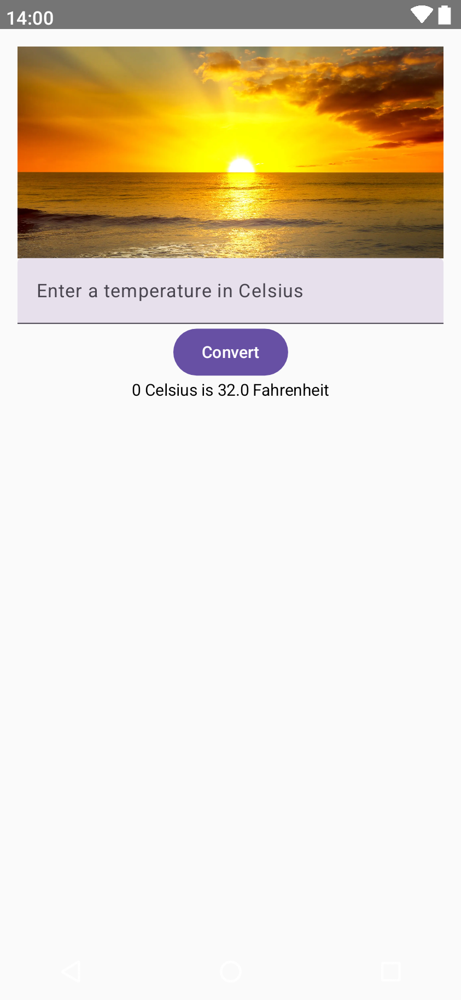
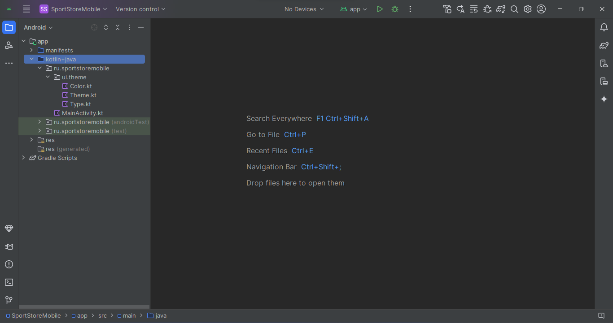

# Практическая работа 18. Jetpack Compose

Во всех пользовательских интерфейсах, которые мы строили
ранее, использовались представления и файлы макетов. Но благодаря инструментарию ```Jetpack Compose``` это не единственный вариант.
В этой работе перед вами развернется мир ```Compose```. Вы научитесь строить
пользовательские интерфейсы из компонентов ```Compose``` вместо представлений. Вы узнаете, как пользоваться такими компонентами ```Compose```, как ```Text```,
```Image```, ```TextField``` и ```Button```, размещать их по строкам и столбцам и применять
стилевое оформление при помощи тем. Вы напишете собственные компонентные функции и даже научитесь управлять состоянием компонентов
Compose с использованием объектов ```MutableState```.

## UI-компоненты не обязаны быть представлениями

До настоящего момента вы учились использовать файлы макетов и представления для
построения элегантных интерактивных пользовательских интерфейсов. Но хотя мы сосредоточились на этом подходе, это не единственный вариант.
Также пользовательские интерфейсы могут строиться на базе ```Jetpack Compose```. Compose является
частью ```Android Jetpack```; это целый инструментарий библиотек, вспомогательных программ и API,
разработанных для построения платформенных пользовательских интерфейсов в чистом коде Kotlin.
К счастью, при работе с ```Jetpack Compose``` можно руководствоваться тем, что вы уже знаете об Android.
Например, с ```Compose``` можно использовать модели представлений и данные ```Live Data``` и даже включать компоненты ```Compose``` в существующие пользовательские интерфейсы.

## Мы построим приложение Compose
В этой главе для знакомства с ```Compose``` мы построим приложение ```Temperature Converter```, которое преобразует
температуру по шкале Цельсия к шкале Фаренгейта. 

Приложение должно выглядеть так:



Как видите, в приложении используются знакомые компоненты.
Тем не менее это приложение написано с использованием ```Compose```.

## Что мы собираемся сделать
Итак, вы увидели примеры кода и поняли, что он делает. Давайте посмотрим, чем нам предстоит заниматься.

1. Создание приложения, отображающего
два текстовых элемента в столбец.
Мы создадим новый проект, который использует ```Compose``` для вывода фиксированного текста. Затем код будет преобразован в компонентную функцию.

2. Перевод температуры из шкалы
Цельсия в шкалу Фаренгейта.
На этом шаге мы построим пользовательский интерфейс, который позволяет ввести температуру в градусах по
Цельсию. По щелчку на кнопке температура преобразуется в шкалу Фаренгейта.

3. Изменение внешнего вида
приложения.
Наконец, вы узнаете, как выровнять
компоненты по центру, использовать
отступы и применять темы.


## Создание нового проекта Compose
Мы создадим новый проект Android Studio, который будет
использовать ```Compose``` для построения своего пользовательского интерфейса. Чтобы создать этот проект, выберите вариант ```Empty Compose Activity```:

При выборе этого варианта в проект включаются библиотеки ```Compose```
и файлы с кодом. Этот тип проекта лучше всего подходит для построения
приложений Android с интерфейсом ```Compose``` с нуля.
После выбора варианта ```Empty Compose Activity``` щелкните на кнопке ```Next```,
чтобы настроить конфигурацию проекта.

## Настройка проекта
Следующий экран должен быть вам знаком — он включает те же параметры, которые использовались для настройки проектов.
Введите имя «Temperature Converter» и имя пакета ru.temperatureconverter», подтвердите папку для сохранения по умолчанию.
Обратите внимание: язык Kotlin выбирается автоматически, и изменить этот выбор не удастся. Приложения Compose могут строиться
только на языке Kotlin, так что выбрать другой язык не разрешается.
Выберите минимальный уровень SDK API 29, чтобы приложение работало на большинстве устройств Android. Это самая старая версия
SDK, доступная для проектов этого типа, потому что инструментарий
Compose совместим только с API 21 и выше.
После выбора всех настроек щелкните на кнопке ```Finish```.

> У проектов Compose нет файлов макетов

Многие файлы и папки должны казаться знакомыми — такие же файлы
и папки генерируются для проектов, не использующих ```Compose```. Например, в проект включен файл активности с именем ```MainActivity.kt``` и файл
строкового ресурса с именем ```strings.xml```.
Главное отличие заключается в том, что Android Studio не генерирует файлы макетов. Проекты ```Compose``` используют для определения внешнего вида экрана код активности вместо макетов.
Когда вы создаете проект в режиме ```Empty Compose Activity```,
Android Studio автоматически создает структуру папок и
заполняет ее всеми файлами, необходимыми для нового
проекта. Структура папок выглядит так:




## Как выглядит код активности Compose

Если вы используете ```Compose```, за поведение и внешний вид приложения отвечает код активности. По этой причине он несколько
отличается от кода активности, с которым вы привыкли работать.
Посмотрим, как выглядит базовый код активности ```Compose```. Откройте пакет ```ru.temperatureconverter``` в папке ```app/src/main/java```
и откройте файл ```MainActivity.kt``` (если он не был открыт ранее).
Затем замените код, сгенерированный Android Studio, следующим кодом:

```kotlin
package ru.temperatureconverter

import android.os.Bundle
import androidx.activity.ComponentActivity
import androidx.activity.compose.setContent
import androidx.activity.enableEdgeToEdge
import androidx.compose.material3.Text
import androidx.compose.runtime.Composable
import androidx.compose.ui.Modifier
import androidx.compose.ui.tooling.preview.Preview

class MainActivity : ComponentActivity() {
    override fun onCreate(savedInstanceState: Bundle?) {
        super.onCreate(savedInstanceState)
        enableEdgeToEdge()
        setContent {
            
        }
    }
}
```

## Активности Compose расширяют ComponentActivity
Как видно из кода, активность ```Compose``` не расширяет ```AppCompatActivity```:
вместо этого она использует ```ComponentActivity.androidx```.

activity.ComponentActivity является субклассом ```Activity```.
Он применяется для определения базовой активности, которая использует
для пользовательского интерфейса ```Compose``` вместо файла макета.
Как и все остальные активности, которые вам встречались, активность
переопределяет метод ```onCreate()```. Но вместо того чтобы вызывать
```setContentView()``` для заполнения макета активности, она использует
```setContent()```. Это файл расширения, который применяется для включения
компонентов ```Compose``` в пользовательский интерфейс активности, чтобы они
выполнялись при создании активности.
Чтобы вы лучше поняли, как работает этот механизм, воспользуемся ```Compose```
для добавления текста в пользовательский интерфейс активности.

## Использование компонента Text для вывода текста

При выполнении этого кода текст будет выведен
в верхней части экрана:
Чтобы в ```MainActivity``` выводился текст, мы добавим компонент ```Text```
в вызов ```setContent()```. Компонент ```Text``` можно рассматривать как
```Compose```- эквивалент текстового представления. Просто укажите текст,
который должен появиться на экране, и он будет выведен в активности.
Ниже приведен код добавления текста в ```MainActivity```; обновите
файл ```MainActivity.kt```:

```kotlin
package ru.temperatureconverter

import android.os.Bundle
import androidx.activity.ComponentActivity
import androidx.activity.compose.setContent
import androidx.activity.enableEdgeToEdge
import androidx.compose.material3.Text
import androidx.compose.runtime.Composable
import androidx.compose.ui.Modifier
import androidx.compose.ui.tooling.preview.Preview

class MainActivity : ComponentActivity() {
    override fun onCreate(savedInstanceState: Bundle?) {
        super.onCreate(savedInstanceState)
        enableEdgeToEdge()
        setContent {
            Text("Hello friend! Welcome to Jetpack Compose.")
        }
    }
}
```

При выполнении этого кода текст будет выведен в верхней части экрана:

Итак, теперь вы знаете, как вывести фиксированный
текст средствами ```Compose```. Давайте сделаем вывод более гибким и добавим ```Text``` в компонентную функцию.

## Использование компонентов Compose в компонентных функциях

**Компонентной функцией** называется функция, использующая один или несколько компонентов ```Compose``` для определения частей пользовательского интерфейса.
Чтобы вы лучше поняли, как работает этот механизм, мы определим компонентную
функцию с именем ```Hello```, которая получает строковый аргумент с именем пользователя.
При выполнении эта функция добавляет строку в компонент ```Text```, предназначенный
для вывода текста в пользовательском интерфейсе.
Код новой функци ```Hello``` выглядит так:

```kotlin
@Composable
fun Hello(name: String) {
 Text("Hello $name! Welcome to Jetpack Compose.")
}
```

Как видите, функция снабжена аннотацией ```@Composable```. Эта
аннотация необходима для всех компонентных функций. Если
опустить эту аннотацию, код не будет компилироваться.

## Вызов компонентной функции ```Hello``` из ```setContent()```

Пометка функции аннотацией ```@Composable``` не означает, что функция использует компоненты ```Compose```; она делает саму функцию компонентом ```Compose```, который может
использоваться в коде, как и любые другие компоненты ```Compose```.
В создаваемом приложении в пользовательском интерфейсе ```MainActivity``` должен
выводиться текст ```Hello```. Для этого следует вызвать ```Hello``` из ```setContent()```:

```kotlin
class MainActivity : ComponentActivity() {
    override fun onCreate(savedInstanceState: Bundle?) {
        super.onCreate(savedInstanceState)
        enableEdgeToEdge()
        setContent {
            Hello("Колледж связи")
        }
    }
}
```

## Многие пользовательские интерфейсы состоят из нескольких компонентов

До настоящего момента вы видели, как использовать один компонент ```Compose```, но на практике пользовательские интерфейсы обычно состоят из нескольких компонентов или одна компонентная функция вызывается в них многократно.

Например, если вы хотите, чтобы в приложении выводились два сообщения, компонентную функцию ```Hello``` можно вызвать дважды с разными аргументами:

```kotlin
Hello("friend")
Hello("everyone")
```

Если ваш пользовательский интерфейс включает несколько компонентов, необходимо указать, как они должны быть размещены.
Если этого не сделать, Compose наложит компоненты друг на друга:

# Row и Column

## Для размещения компонентов можно использовать компоненты Row и Column

Обычно компоненты размещаются по строкам или по столбцам, и в ```Compose``` имеются
компоненты ```Row``` и ```Column``` для решения этой задачи. Например, чтобы разместить
два компонента ```Hello``` в столбец, достаточно добавить их в компонент ```Column```:

```kt
Column {
 Hello("friend")
 Hello("everyone")
}
```
При выполнении этого кода компоненты выстраиваются в столбец:

Обновим активность ```MainActivity``` так, чтобы она строила этот пользовательский интерфейс.

## Полный код MainActivity.kt

Мы добавим компонентную функцию ```Hello``` в ```MainActivity.kt```, выполним ее дважды и разместим результаты в столбец.
Ниже приведен полный код новой версии; обновите файл ```MainActivity.kt```:

```kotlin
class MainActivity : ComponentActivity() {
    override fun onCreate(savedInstanceState: Bundle?) {
        super.onCreate(savedInstanceState)
        enableEdgeToEdge()
        setContent {
            Greeting()
        }
    }
}

@Composable
fun Hello(name: String) {
    Text("Hello $name! Welcome to Jetpack Compose.")
}

@Composable
fun Greeting() {
    Column{
        Hello("Колледж связи")
        Hello("Ребята")
    }
}
```

Давайте проведем тест-драйв приложения и посмотрим,
как выглядит результат.

При выполнении приложения отображается активность ```MainActivity```. Она включает два компонента ```Hello```, выстроенных в один столбец.

Поздравляем! Вы научились использовать ```Compose``` для
создания пользовательского интерфейса ```MainActivity```
вместо добавления представлений в файл макета.

## Предварительный просмотр компонентных функций

У компонентных функций есть еще одна особенность: их результаты
можно предварительно просматривать в Android Studio, не загружая
приложение на устройство. Это можно делать с любой компонентной
функцией, которая не получает аргументов, и даже использовать этот
прием для предварительного просмотра целых композиций — пользовательских интерфейсов, состоящих из компонентов ```Compose```.

Чтобы сообщить, что вы хотите выполнить предварительный просмотр
компонентной функции, снабдите ее аннотацией ```@Preview```. Например, следующий код определяет компонентную функцию с именем
```PreviewMainActivity``` и позволяет выполнить предварительный просмотр двух компонентов ```Hello```, выстроенных в столбец:

```kotlin
@Preview(showBackground = true)
@Composable
fun PreviewMainActivity() {
 Column {
 Hello("friend")
 Hello("everyone")
 }
}
```

## Предварительный просмотр компонентов в режимах Design и Split

Любые компонентные функции, помеченные аннотацией ```@Preview```,
можно просмотреть в режиме ```Split``` или ```Design``` файла активности.
Режим ```Split``` позволяет просматривать код одновременно с результатом, а в режиме ```Design``` отображается только результат.

Если вы внесете изменения в компонентную функцию, которая задействована в предварительном просмотре, результат
необходимо обновить. Просто щелкните на кнопке ```Build Refresh``` в верхнем меню предварительного просмотра, и вы
увидите последствия внесенных изменений.
Итак, теперь вы знаете, как просмотреть результат компонентной функции.

## Преобразование температур в приложении

До настоящего момента мы использовали ```Compose``` для вывода текста, написали несколько компонентных функций и научились включать предварительный просмотр. Однако это еще не все.
В оставшейся части этой главы мы погрузимся в ```Compose``` и изменим только что построенное приложение, чтобы оно переводило температуру из шкалы Цельсия в шкалу Фаренгейта. Вместо того чтобы приветствовать
пользователя, приложение будет запрашивать температуру по Цельсию,
а затем по щелчку на кнопке переводить значение к шкале Фаренгейта.

## Добавление компонентной функции MainActivityContent

Начнем с добавления в ```MainActivity.kt``` новой компонентной функции с именем ```MainActivityContent```, предназначенной для основного содержания
активности. В эту функцию будут добавлены все компоненты, необходимые
для пользовательского интерфейса ```MainActivity```, и она будет вызываться
из ```setContent()``` и ```PreviewMainActivity```. В частности, это означает, что
композиция активности будет отображаться как при запуске приложения,
так и при предварительном просмотре.
Также из кода будет удалена компонентная функция ```Hello```, которая стала
лишней. Ниже приведена новая версия кода ```MainActivity.kt```; обновите файл:

```kotlin
package ru.temperatureconverter

import android.os.Bundle
import androidx.activity.ComponentActivity
import androidx.activity.compose.setContent
import androidx.activity.enableEdgeToEdge
import androidx.compose.runtime.Composable
import androidx.compose.ui.tooling.preview.Preview

class MainActivity : ComponentActivity() {
    override fun onCreate(savedInstanceState: Bundle?) {
        super.onCreate(savedInstanceState)
        enableEdgeToEdge()
        setContent {
            MainActivityContent()
        }
    }
}

@Composable
fun MainActivityContent(){
    
}

@Preview(showBackground = true, showSystemUi = true)
@Composable
fun MainActivityContentPreview() {
    MainActivityContent()
}
```

## Вывод изображения в заголовке с использованием компонента Image

Первым компонентом, добавленным в ```MainActivityContent```,
будет изображение, которое отображается в верхней части экрана.
Сначала убедитесь в том, что проект содержит папку ```app/src/main/res/drawable``` (если папки нет, создайте ее самостоятельно). Затем загрузите файл ```sunrise.webp``` из ресурсов и добавьте его в папку ```drawable```.

Для вывода изображения в ```Compose``` используется компонент ```Image```. Основной код выглядит так:

```kotlin
Image(
 painter = painterResource(R.drawable.sunrise),
 contentDescription = "sunrise image"
)
```

Компоненту ```Image``` должны передаваться два аргумента: ```painter``` и ```contentDescription```.
Аргумент ```painter``` определяет изображение, которое должно выводиться.

В данном случае значение ```painterResource(R.drawable.sunrise)``` выводит графический ресурс ```sunrise.webp```.

Аргумент ```contentDescription``` содержит описание изображения, которое выводится для пользователей с ограниченными возможностями.
Существует много других необязательных аргументов, которые могут
использоваться для управления внешним видом изображения и параметрами его отображения. Например, следующий код устанавливает высоту
изображения 180dp, заполняет всю доступную ширину и масштабирует
изображение:

```kotlin
Image(
 painter = painterResource(R.drawable.sunrise),
 contentDescription = "sunrise image",
 modifier = Modifier
 .height(180.dp)
 .fillMaxWidth(),
 contentScale = ContentScale.Crop
)
```
Теперь вы знаете, как добавить изображение в ```Compose```,
и мы можем добавить его в ```MainActivity```.

## Добавление Image в MainActivity.kt

Чтобы добавить изображение в ```MainActivity```, мы определим
в ```MainActivity.kt``` новую компонентную функцию (с именем ```Header```), которая создает это изображение. Функция будет выполняться из компонентной функции ```MainActivityContent```, чтобы изображение добавлялось
в пользовательский интерфейс и в режим предварительного просмотра.
Ниже приведена новая версия ```MainActivity.kt```; обновите этот файл:

```kotlin
import androidx.compose.foundation.Image
import androidx.compose.foundation.layout.fillMaxWidth
import androidx.compose.foundation.layout.height
import androidx.compose.ui.Modifier
import androidx.compose.ui.layout.ContentScale
import androidx.compose.ui.res.painterResource
import androidx.compose.ui.unit.dp
...
@Composable
fun Header(image: Int, description: String) {
    Image(
        painter = painterResource(image),
        contentDescription = description,
        modifier = Modifier
            .height(180.dp)
            .fillMaxWidth(),
        contentScale = ContentScale.Crop
    )
}
@Composable
fun MainActivityContent() {
    Header(R.drawable.sunrise, "sunrise image")
}
```
И это все, что необходимо знать для вывода изображения
в композиции. Давайте перейдем к следующему компоненту.


## Вывод температуры в виде текста

На следующем шаге мы добавим компонентную функцию (с именем
```TemperatureText```), которая преобразует температуру из шкалы
Цельсия в шкалу Фаренгейта и выводит результат. Эта функция будет
вызываться из ```MainActivityContent```, чтобы она включалась как
в пользовательский интерфейс, так и в предварительный просмотр.
Код решения этой задачи вам уже знаком, поэтому обновите файл
```MainActivity.kt```:

```kotlin
@Composable
fun TemperatureText(celsius: Int) {
 val fahrenheit = (celsius.toDouble()*9/5)+32
 Text("$celsius Celsius is $fahrenheit Fahrenheit")
}
@Composable
fun MainActivityContent() {
 Column {
 Header(R.drawable.sunrise, "sunrise image")
 TemperatureText(0)
 }
}
```
При выполнении (или предварительном просмотре)
приложение выводит ```Image``` и ```Text``` в столбец. Компонент ```Text``` правильно отображает температуру 0°
по Цельсию в шкале Фаренгейта.
Мы добились того, чтобы функция ```TemperatureText```
работала с жестко фиксированной температурой. Обновим его новой температурой, когда пользователь
щелкает на кнопке.

## Использование компонента Button для добавления кнопки

Для добавления кнопок в ```Compose``` используется компонент ```Button```.

Код ```Button``` выглядит примерно так:

```kotlin
Button(onClick = {
 //Код, выполняемый по щелчку
}) { Text("Button Text") }
```

При использовании компонента ```Button``` необходимо задать два аспекта: поведение по щелчку и то, что должно отображаться на кнопке.
Поведение по щелчку задается аргументом ```onClick``` компонента ```Button```. Он
получает лямбда-выражение, которое выполняется при каждом щелчке на кнопке.
Чтобы указать, что должно отображаться на кнопке, вы используете отдельное
лямбда-выражение, которое включает компонент ```Compose```. При выполнении
кода этот компонент добавляется на кнопку. Например, в приведенном выше
коде ```Button``` передается компонент ```Text```, поэтому при выполнении создается
кнопка с текстом.

## Создание компонентной функции ConvertButton
Мы добавим в приложение ```Temperature Converter``` компонент ```Button```, по щелчку
на котором изменяется температура, которую ```TemperatureText``` преобразует
к шкале Фаренгейта. Для этого мы напишем новую компонентную функцию
(с именем ```ConvertButton```), которая выводит компонент ```Button```. Также будет
указано, что функция получает аргумент с лямбда-выражением, которое определяет поведение ```Button``` по щелчку.
Ниже показано, как выглядит код компонентной функции ```ConvertButton```;
через несколько страниц мы добавим его в ```MainActivity.kt```:

```kotlin
@Composable
fun ConvertButton(clicked: () -> Unit) {
 Button(onClick = clicked) {
 Text("Convert")
 }
}
```
Функция ```ConvertButton``` готова. Добавим ее в ```MainActivityContent```,
чтобы компонент ```Button``` был включен в пользовательский интерфейс.

> ConvertButton должно передаваться лямбда-выражение

Чтобы выполнить функцию ```ConvertButton``` из ```MainActivityContent```,
необходимо передать ей лямбда-выражение, которое определяет, что
должно происходить по щелчку на кнопке. Код должен выглядеть примерно так:

```kotlin
@Composable
fun MainActivityContent() {
 ...
 ConvertButton {
 //Код, выполняемый по щелчку на кнопке
 }
 ...
}
```
Когда пользователь щелкает на кнопке ```ConvertButton```, текст, отображаемый в ```TemperatureText```, должен обновляться. Если бы компонент
```TemperatureText``` был представлением, то текст можно было бы обновить кодом следующего вида:

```kotlin
binding.textView.text = "This is the new text"
```

Такой подход работает для представлений, но не для компонентов ```Compose```.
С компонентами ```Compose``` придется действовать иначе.

Компоненты ```Compose``` и представления работают по-разному.
Хотя представления и компоненты ```Compose``` позволяют выводить похожие компоненты (текст, кнопки
и т. д.), они делают это разными способами. Компонент
```Compose``` не является разновидностью представления,
а представление не является разновидностью компонента ```Compose```, поэтому для взаимодействия с компонентами ```Compose``` придется действовать по другим правилам.
Чтобы вы увидели, как это делается, разберемся, что
происходит при формировании пользовательского
интерфейса в композициях.

## Необходимо изменить значение аргумента TemperatureText

Как было показано ранее, компоненты ```Compose``` перестраиваются
при изменении значений, от которых они зависят. Это означает, что
если вы хотите, чтобы в ```TemperatureText``` выводился разный текст,
когда пользователь щелкает на кнопке ```ConvertButton```, передаваемое
```ConvertButton``` лямбда-выражение должно обновить значение аргумента ```TemperatureText```.
Для этого мы добавим в ```MainActivityContent``` новую переменную
```celsius``` и передадим ее значение ```TemperatureText```. Когда пользователь щелкает на компоненте ```ConvertButton```, значение ```celsius```
будет обновлено, чтобы компонент ```TemperatureText``` был перестроен.

## Использование remember для сохранения значения в памяти

Переменная ```celsius``` определяется включением следующего
кода в ```MainActivityContent```:

```kotlin
val celsius = remember { mutableStateOf(0) }
```

Эта команда создает объект с типом ```MutableState```, присваивает
ему значение 0 и сохраняет в памяти. Работа с ```celsius``` напоминает работу с объектом ```Live Data```. Каждый раз, когда ему присваивается новое значение, все использующие его компоненты
Compose получают оповещения и перестраиваются.
Для сохранения объекта в памяти используется функция
```remember```. remember сохраняет объект в тот момент, когда вызывающая ее компонентная функция — в данном случае
```MainActivityContent``` — проходит первое построение, и «забывает» его при удалении компонента Compose из пользовательского
интерфейса. Это может произойти, когда пользователь поворачивает устройство и активность — вместе с ее пользовательским
интерфейсом — уничтожается и создается заново.
Как и в случае с объектами ```MutableLiveData```, значение объекта
```MutableState``` задается обновлением его свойства ```value```. Например, чтобы по щелчку на компоненте ```ConvertButton``` переменной
```celsius``` присваивалось значение 20, используется следующий код:

```kotlin
ConvertButton { celsius.value = 20 }
```
Чтобы компонент ```TemperatureText``` реагировал на изменение
значения, в аргументе следует передать ```celsius.value```:

```kotlin
TemperatureText(celsius.value)
```
При каждом обновлении ```celsius.value``` компонент ```TemperatureText```
перестраивается с новым значением, что приводит к изменению отображаемого текста. Полный код будет приведен через пару страниц.

## Полный код MainActivity.kt
Ниже приведен полный код ```MainActivity.kt```; обновите файл:

```kotlin
package ru.temperatureconverter

import android.os.Bundle
import androidx.activity.ComponentActivity
import androidx.activity.compose.setContent
import androidx.compose.foundation.layout.Column
import androidx.compose.material.Text
import androidx.compose.runtime.Composable
import androidx.compose.ui.tooling.preview.Preview
import androidx.compose.foundation.Image
import androidx.compose.foundation.layout.fillMaxWidth
import androidx.compose.foundation.layout.height
import androidx.compose.ui.Modifier
import androidx.compose.ui.layout.ContentScale
import androidx.compose.ui.res.painterResource
import androidx.compose.ui.unit.dp
import androidx.compose.material.Button
import androidx.compose.runtime.mutableStateOf
import androidx.compose.runtime.remember
class MainActivity : ComponentActivity() {
    override fun onCreate(savedInstanceState: Bundle?) {
        super.onCreate(savedInstanceState)
        setContent {
            MainActivityContent()
        }
    }
}
@Composable
fun TemperatureText(celsius: Int) {
    val fahrenheit = (celsius.toDouble()*9/5)+32
    Text("$celsius Celsius is $fahrenheit Fahrenheit")
}
@Composable
fun ConvertButton(clicked: () -> Unit) {
    Button(onClick = clicked) {
        Text("Convert")
    }
}
@Composable
fun Header(image: Int, description: String) {
    Image(
        painter = painterResource(image),
        contentDescription = description,
        modifier = Modifier
            .height(180.dp)
            .fillMaxWidth(),
        contentScale = ContentScale.Crop
    )
}
@Composable
fun MainActivityContent() {
    val celsius = remember { mutableStateOf(0) }
    Column {
        Header(R.drawable.sunrise, "sunrise image")
        ConvertButton { celsius.value = 20 }
        TemperatureText(celsius.value)
    }
}
@Preview(showBackground = true)
@Composable
fun PreviewMainActivity() {
    MainActivityContent()
}
```

## Что происходит при выполнении приложения
При выполнении приложения происходят следующие события:

1. Запускается активность ```MainActivity```, и выполняется ее метод ```onCreate()```.
Он вызывает метод ```setContent()```, который выполняет компонентную функцию ```MainActivityContent```.

2. ```MainActivityContent``` создает переменную ```MutableState<Int>```
с именем ```celsius```, присваивает ей значение ```0``` и сохраняет в памяти.

3. ```MainActivityContent``` выполняет компонентные функции ```Header```,
```ConvertButton``` и ```TemperatureText```.
Значение ```celsius``` передается компонентной функции ```TemperatureText```,
которая преобразует температуру к шкале Фаренгейта.

4. Компонентные функции ```Header```, ```ConvertButton``` и ```TemperatureText```
добавляют в пользовательский интерфейс изображение, кнопку и текст.

5. Пользователь щелкает на компоненте ```ConvertButton```
в пользовательском интерфейсе.
Свойству ```value``` объекта ```celsius``` присваивается значение ```20```.

6. ```TemperatureText``` перестраивается.
Новое значение ```celsius``` преобразуется к шкале ```Фаренгейта```, а результат
преобразования выводится.

При запуске приложения отображается активность ```MainActivity```. Она включает изображение, кнопку и текст, который представляет значение 0° по Цельсию по шкале Фаренгейта.
Если щелкнуть на кнопке ```Convert```, текст обновляется значением, соответствующим 20°
по Цельсию, по шкале Фаренгейта.

##  Ввод температуры
До настоящего момента мы строили версию приложения
```Temperature Converter```, которая преобразует жестко фиксированную температуру по Цельсию к шкале Фаренгейта.
Когда пользователь щелкает на кнопке, исходная температура преобразуется в другое значение.
Но на самом деле нужно, чтобы пользователь мог ввести
любую интересующую его температуру, поэтому на следующем шаге в пользовательский интерфейс будет добавлено
текстовое поле. Пользователь вводит температуру по Цельсию в текстовом поле; по щелчку на кнопке приложение
преобразует введенную температуру к шкале Фаренгейта
и выводит результат:

## Добавление компонента TextField
Чтобы добавить текстовое поле в интерфейс, мы воспользуемся компонентом ```TextField```. Его можно рассматривать
как аналог ```EditText``` в мире Compose.
Код добавления ```TextField``` выглядит примерно так:

```kotlin
@Composable
fun ExampleTextField() {
 val text = remember { mutableStateOf("") }
 TextField(
 value = text.value,
 onValueChange = { text.value = it },
 label = { Text("What is your name?") }
 )
}
```

Атрибут ```value``` используется для получения значения ```TextField```.
В данном примере для сохранения этого значения в памяти используется переменная ```MutableState``` с именем ```text```.
Атрибут ```onValueChange``` использует лямбда-выражение для обновления значения переменной ```text``` при вводе текста пользователем.
Атрибут ```label``` определяет описание ```TextField```. Этот текст отображается в пустом поле ```TextField``` и исчезает, когда пользователь
вводит текст.
Теперь вы знаете, как выглядит код текстового поля, и мы можем
добавить компонент в приложение.

## Добавление TextField в компонентную функцию

Чтобы добавить компонент ```TextField``` в пользовательский интерфейс,
мы создадим новую компонентную функцию ```EnterTemperature```,
которая будет вызываться из ```MainActivityContent```.
Код функции ```EnterTemperature``` выглядит так:

```kotlin
@Composable
fun EnterTemperature(temperature: String, changed: (String) -> Unit) {
    TextField(
        value = temperature,
        label = { Text("Enter a temperature in Celsius") },
        onValueChange = changed,
        modifier = Modifier.fillMaxWidth()
    )
}
```

Как видите, функция получает два аргумента: строку со значением ```TextField``` и лямбда-выражение, которое определяет, что должно происходить при вводе нового значения пользователем.

## Вызов функции в ```MainActivityContent```
Функция ```MainActivityContent``` должна передавать оба аргумента ```EnterTemperature``` при выполнении функции, поэтому мы используем новый объект ```MutableState``` с именем ```newCelsius```
для представления значения, которое обновляется при вводе текста пользователем.
Также мы изменим лямбда-выражение, передаваемое ```ConvertButton```, чтобы оно обновляло
значение ```celsius``` при вводе пользователем допустимого значения ``Int``; это приводит к перестраиванию ```TemperatureText``` при вводе пользователем новой температуры.
Код приводится ниже; мы займемся обновлением ```MainActivity.kt``` на следующей странице:

```kotlin
@Composable
fun MainActivityContent() {
    val celsius = remember { mutableStateOf(0) }
    val newCelsius = remember { mutableStateOf("") }
    ...
    EnterTemperature(newCelsius.value) { newCelsius.value = it }
    ConvertButton {
        newCelsius.value.toIntOrNull()?.let {
            celsius.value = it
        }
    }
    ...
}
```

## Полный код MainActivity.kt
Ниже приведен код MainActivity.kt; обновите файл (изменения
выделены жирным шрифтом):

```kotlin
import androidx.compose.material.TextField
class MainActivity : ComponentActivity() {
    override fun onCreate(savedInstanceState: Bundle?) {
        super.onCreate(savedInstanceState)
        setContent {
            MainActivityContent()
        }
    }
}
@Composable
fun TemperatureText(celsius: Int) {
    val fahrenheit = (celsius.toDouble()*9/5)+32
    Text("$celsius Celsius is $fahrenheit Fahrenheit")
}
@Composable
fun ConvertButton(clicked: () -> Unit) {
    Button(onClick = clicked) {
        Text("Convert")
    }
}
@Composable
fun EnterTemperature(temperature: String, changed: (String) -> Unit) {
    TextField(
        value = temperature,
        label = { Text("Enter a temperature in Celsius") },
        onValueChange = changed,
        modifier = Modifier.fillMaxWidth()
    )
}
@Composable
fun Header(image: Int, description: String) {
    Image(
        painter = painterResource(image),
        contentDescription = description,
        modifier = Modifier
            .height(180.dp)
            .fillMaxWidth(),
        contentScale = ContentScale.Crop
    )
}
@Composable
fun MainActivityContent() {
    val celsius = remember { mutableStateOf(0) }
    val newCelsius = remember { mutableStateOf("") }
    Column {
        Header(R.drawable.sunrise, "sunrise image")
        EnterTemperature(newCelsius.value) { newCelsius.value = it }
        ConvertButton {
            newCelsius.value.toIntOrNull()?.let {
                celsius.value = 20 it
            }
        }
        TemperatureText(celsius.value)
    }
}
@Preview(showBackground = true)
@Composable
fun PreviewMainActivity() {
    MainActivityContent()
}
```

Посмотрим, что происходит при выполнении кода.

## Что происходит при выполнении приложения
При выполнении приложения происходят следующие события:

1. При выполнении активности ```MainActivityContent``` создается переменная
```MutableState<Int>``` с именем ```celsius``` и переменная ```MutableState<String>```
с именем ```newCelsius```.
celsius присваивается 0, ```newCelsius``` присваивается "", и оба значения
сохраняются в памяти.

2. ```MainActivityContent``` выполняет компонентные функции
```EnterTemperature```, ```Header```, ```ConvertButton``` и ```TemperatureText```.
Компонентной функции ```TemperatureText``` передается значение ```celsius```, которое преобразуется к шкале Фаренгейта.

3. Компонентные функции ```Header```, ```EnterTemperature```, ```ConvertButton```
и ```TemperatureText``` добавляют в пользовательский интерфейс
изображение, текстовое поле, кнопку и текст.

4. Пользователь вводит новое значение в ```EnterTemperature```
(в данном примере "25").
```EnterTemperature``` присваивает это значение ```newCelsius```.

5. Пользователь щелкает на компоненте ```ConvertButton```.
Значение ```newCelsius``` преобразуется в ```Int``` и присваивается ```celsius.value```.

6. ```TemperatureText``` перестраивается.
Новое значение celsius преобразуется к шкале Фаренгейта, а результат
выводится на экран.

При запуске приложения ```MainActivity``` отображает текстовое поле.
Если ввести температуру и щелкнуть на кнопке ```Convert```, приложение
преобразует температуру по Цельсию к шкале Фаренгейта и обновляет
текстовое сообщение с температурой.

Теперь приложение работает именно так, как нужно. Остается внести ряд мелких улучшений во внешний вид приложения.

## Настройка внешнего вида приложения
Нам предстоит изменить приложение так, чтобы оно отделялось
от краев экрана отступами, а UI-компоненты (например, кнопки)
были выровнены горизонтально по центру. Мы также применим
стилевое оформление к компонентным функциям, чтобы они
использовали тему ```Material``` по умолчанию.

Начнем с добавления отступов у краев пользовательского интерфейса.

## Добавление отступов к компоненту Column
Мы хотим добавить отступы между краями экрана и компонентами приложения, чтобы оно выглядело так:

Отступы будут применяться к компоненту ```Column```. Применение отступов
к компонентам имеет такой же эффект, как c представлениями; вокруг краев
компонента появляется дополнительное свободное пространство.
Для добавления отступов к компонентам используются модификаторы — объекты ```Modifier```, позволяющие добавлять дополнительное поведение к компонентам ```Compose```. Например, для добавления отступов ```16dp``` к компоненту
Column используется следующий код:

```kotlin
Column(modifier = Modifier.padding(16.dp)) {
 ...
}
```
Модификаторы в высшей степени гибки. Например, при написании компонентной функции ```Header``` мы использовали ```Modifier```
для задания высоты и ширины ```Image```:

```kotlin
Image(
 ...
 modifier = Modifier.height(180.dp).fillMaxWidth()
)
```
Отступы будут добавлены к компоненту ```Column``` приложения позже. Но сначала разберемся, как выровнять кнопку по центру

## Выравнивание компонентов по центру Column или Row
Чтобы выровнять по центру один или несколько компонентов ```Compose```, например ```Button``` или ```Text```, можно воспользоваться компонентами ```Column``` и ```Row```.
Есть пара возможных решений в зависимости от того, что вы хотите сделать.

## Выравнивание по центру всего содержимого Column

Если вы хотите разместить компоненты внутри компонента
```Column```, чтобы все они были выровнены по центру, для этого
можно назначить ```Column``` максимально возможную ширину, а затем задать его аргумент ```horizontalAlignment```.
Например, для горизонтального выравнивания по центру всех
компонентов в приложении ```Temperature Converter``` в ```Column``` добавляется следующий код:

```kotlin
@Composable
fun MainActivityContent() {
 ...
 Column(modifier = Modifier.padding(16.dp).fillMaxWidth(),
 horizontalAlignment = Alignment.CenterHorizontally) {
 ...
 }
}
```
## Выравнивание по центру содержимого одного компонента

Если вы хотите выполнить горизонтальное выравнивание по центру только одного компонента, заключите его в ```Row```. Измените
компонент ```Row```, назначив ему максимально возможную ширину,
после чего задайте его атрибут ```horizontalArrangement```.
Например, для компонента ```ConvertButton``` включение в ```Row```
и горизонтальное выравнивание по центру могут выполняться
следующим образом:

```kotlin
@Composable
fun MainActivityContent() {
    ...
    Column(modifier = Modifier.padding(16.dp).fillMaxWidth()) {
        ...
        Row(modifier = Modifier.fillMaxWidth(),
            horizontalArrangement = Arrangement.Center) {
            ConvertButton { ... }
        }
        ...
    }
}
```

Итак, компоненты ```Column``` и ```Row``` могут использоваться для выравнивания
и размещения компонентов. Но прежде чем обновлять ```MainActivity.kt```,
осталось рассмотреть еще один вопрос: применение тем к компонентам.

## Снова о применении тем

Темы определяют общие особенности внешнего вида приложения. Например, назначение темы позволяет убрать
панель приложения по умолчанию или изменить цвета приложения.
Тему можно определить в одном из ресурсных
файлов приложения, который указывается в ```AndroidManifest.xml```. Тем
самым вы применяете тему к приложению, включая все его представления. Однако при этом тема не распространяется на его компоненты
```Compose```. Чтобы применить к ним стилевое оформление, необходимо
действовать иначе.

## Применение темы к компонентам ```Compose```
Если вы хотите применить тему к композиции, придется использовать код ```Kotlin```. Например, в следующем коде используется тема
```MaterialTheme``` и компоненты ```Surface``` для применения темы
к ```MainActivityContent```:

```kotlin
class MainActivity : ComponentActivity() {
    override fun onCreate(savedInstanceState: Bundle?) {
        super.onCreate(savedInstanceState)
        setContent {
            MaterialTheme {
                Surface {
                    MainActivityContent()
                }
            }
        }
    }
}
```

```MaterialTheme``` используется для применения темы ```Material``` по умолчанию к компонентам ```Compose```. В данном случае она применяется к ```MainActivityContent``` и компонентным функциям, которые вызываются этой функцией (таким, как ```TemperatureText```
и ```ConvertButton```).
В приведенном коде также встречается компонент ```Surface```, который используется для
стилевого оформления поверхностей. В частности, он используется для применения
3D-эффектов и теней.
Если вы захотите переопределить тему ```MaterialTheme``` по умолчанию, определите новую тему в коде Kotlin. Android Studio обычно добавляет код темы при создании нового
проекта с активностью ```Compose```; рассмотрим этот код, чтобы понять, что он делает.

## Android Studio включает дополнительный код темы

При создании проекта ```Temperature Converter``` среда
Android Studio добавила дополнительные файлы Kotlin
для определения новой темы. Это файлы с именами ```Color.kt```, ```Shape.kt```, ```Theme.kt``` и ```Type.kt```, и находятся они в папке ```app/src/main/java``` из пакета ```ru.temperatureconverter.ui.theme```.
Самый важный из них — файл ```Theme.kt```, определяющий новую тему для приложения. Тема называется
```TemperatureConverterTheme```, а ее код выглядит так:

```kotlin
package ru.temperatureconverter.ui.theme

import android.os.Build
import androidx.compose.foundation.isSystemInDarkTheme
import androidx.compose.material3.MaterialTheme
import androidx.compose.material3.darkColorScheme
import androidx.compose.material3.dynamicDarkColorScheme
import androidx.compose.material3.dynamicLightColorScheme
import androidx.compose.material3.lightColorScheme
import androidx.compose.runtime.Composable
import androidx.compose.ui.platform.LocalContext

private val DarkColorScheme = darkColorScheme(
    primary = Purple80,
    secondary = PurpleGrey80,
    tertiary = Pink80
)

private val LightColorScheme = lightColorScheme(
    primary = Purple40,
    secondary = PurpleGrey40,
    tertiary = Pink40

    /* Other default colors to override
    background = Color(0xFFFFFBFE),
    surface = Color(0xFFFFFBFE),
    onPrimary = Color.White,
    onSecondary = Color.White,
    onTertiary = Color.White,
    onBackground = Color(0xFF1C1B1F),
    onSurface = Color(0xFF1C1B1F),
    */
)


@Composable
fun TemperatureConverterTheme(
    darkTheme: Boolean = isSystemInDarkTheme(),
    // Dynamic color is available on Android 12+
    dynamicColor: Boolean = true,
    content: @Composable () -> Unit
) {
    val colorScheme = when {
        dynamicColor && Build.VERSION.SDK_INT >= Build.VERSION_CODES.S -> {
            val context = LocalContext.current
            if (darkTheme) dynamicDarkColorScheme(context) else dynamicLightColorScheme(context)
        }

        darkTheme -> DarkColorScheme
        else -> LightColorScheme
    }

    MaterialTheme(
        colorScheme = colorScheme,
        typography = Typography,
        content = content
    )
}
```

Как видите, тема переопределяет цвета, шрифты и геометрические
фигуры ```MaterialTheme```. Если вы захотите настроить какие-либо из
этих аспектов, это можно сделать обновлением файлов в пакете ```.ui.theme```.

## Применение темы
После того как тема будет определена, ее можно применить
к компонентам приложения. Например, для применения темы
```TemperatureConverterTheme``` к ```MainActivityContent``` используется следующий код:

```kotlin
setContent {

            MaterialTheme {
                Surface {
                    MainActivityContent()
                }
            }
        }
```

# Полный код MainActivity.kt

Теперь вы знаете все необходимое для настройки внешнего вида
пользовательского интерфейса и приведения его к нужному виду.
Ниже приведен полный код ```MainActivity.kt```; обновите содержимое
файла:

```kotlin
package ru.temperatureconverter

import android.os.Bundle
import androidx.activity.ComponentActivity
import androidx.activity.compose.setContent
import androidx.activity.enableEdgeToEdge
import androidx.compose.foundation.Image
import androidx.compose.foundation.layout.Column
import androidx.compose.foundation.layout.fillMaxWidth
import androidx.compose.foundation.layout.height
import androidx.compose.foundation.layout.padding
import androidx.compose.material3.Button
import androidx.compose.material3.MaterialTheme
import androidx.compose.material3.Surface
import androidx.compose.material3.Text
import androidx.compose.material3.TextField
import androidx.compose.runtime.Composable
import androidx.compose.runtime.mutableStateOf
import androidx.compose.runtime.remember
import androidx.compose.ui.Alignment
import androidx.compose.ui.layout.ContentScale
import androidx.compose.ui.res.painterResource
import androidx.compose.ui.tooling.preview.Preview
import androidx.compose.ui.unit.dp
import androidx.compose.ui.Modifier

class MainActivity : ComponentActivity() {
    override fun onCreate(savedInstanceState: Bundle?) {
        super.onCreate(savedInstanceState)
        enableEdgeToEdge()
        setContent {

            MaterialTheme {
                Surface {
                    MainActivityContent()
                }
            }
        }
    }
}

@Composable
fun Header(image: Int, description: String) {
    Image(
        painter = painterResource(image),
        contentDescription = description,
        modifier = Modifier.height(180.dp).fillMaxWidth(),
        contentScale = ContentScale.Crop
    )
}

@Composable
fun TemperatureText(celsius: Int) {
    val fahrenheit = (celsius.toDouble()*9/5)+32
    Text("$celsius Celsius is $fahrenheit Fahrenheit")
}

@Composable
fun ConvertButton(clicked: () -> Unit) {
    Button(onClick = clicked) {
        Text("Convert")
    }
}

@Composable
fun ExampleTextField() {
    val text = remember { mutableStateOf("") }
    TextField(
        value = text.value,
        onValueChange = { text.value = it },
        label = { Text("What is your name?") }
    )
}

@Composable
fun EnterTemperature(temperature: String, changed: (String) -> Unit) {
    TextField(
        value = temperature,
        label = { Text("Enter a temperature in Celsius") },
        onValueChange = changed,
        modifier = Modifier.fillMaxWidth()
    )
}

@Composable
fun MainActivityContent(){

    val celsius = remember { mutableStateOf(0) }
    val newCelsius = remember { mutableStateOf("") }

    Column(modifier = Modifier.padding(15.dp),horizontalAlignment = Alignment.CenterHorizontally){
        Header(R.drawable.sunrise, "sunrise image")
        EnterTemperature(newCelsius.value) { newCelsius.value = it }
        ConvertButton {
            newCelsius.value.toIntOrNull()?.let {
                celsius.value = it
            }
        }
        TemperatureText(celsius.value)
    }
}

@Preview(showBackground = true, showSystemUi = true)
@Composable
fun MainActivityContentPreview() {
    MainActivityContent()
}
```

При запуске приложения отображается активность ```MainActivity```,
а пользовательский интерфейс выглядит именно так, как нужно.
Область компонентов отделена отступами от краев экрана, кнопка
выравнивается по центру, а в интерфейсе используется тема ```Material``` по умолчанию.

# Резюме

- ```Jetpack Compose``` позволяет строить платформенные пользовательские интерфейсы в коде Kotlin.
- Пользовательский интерфейс строится
из компонентов ```Compose``` (вместо представлений и макетов).
- Активности ```Compose``` расширяют класс
```ComponentActivity```.
- Все компоненты ```Compose```, выполняемые
из ```setContent()```, включаются в пользовательский интерфейс активности.
- Компонентной функцией называется
функция, использующая один или несколько компонентов ```Compose```. Она
должна быть помечена аннотацией
```@Composable```.
- Чтобы выполнять предварительный
просмотр результатов компонентных
функций без аргументов, используйте
аннотацию ```@Preview```.
- Компонент ```Text``` предназначен для вывода текста.
- Компоненты ```Row``` и ```Column``` предназначены для размещения компонентов
по строкам и столбцам.
- Компонент ```Image``` предназначен для
вывода изображений.
- Компонент ```Button``` предназначен для
вывода кнопок.
- Компоненты перестраиваются только
при обновлении значений, от которых
они зависят.
- Функция remember используется для
сохранения объектов в памяти.
- Функция ```mutableStateOf()``` создает
объект ```MutableState```, значения которого могут обновляться.
- Компонент ```TextField``` предназначен
для вывода текстового поля.
- Модификаторы (```Modifier```) добавляют
поведение к компонентам.
- ```Column``` и ```Row``` используются для выравнивания компонентов по центру.
- ```MaterialTheme``` используется для применения к компонентам темы ```Material``` по
умолчанию.
- Тему по умолчанию можно переопределить; создайте новую тему в коде Kotlin
и примените ее к пользовательскому
интерфейсу.
- Компонент ```Surface``` используется
для назначения стилей к поверхностям
и применения 3D-эффектов.