# Глава 1: Принципы проектирования

«Состояние» - сердце декларативных представлений

Первая парадигма, которую мы должны четко представлять при разработке декларативных представлений с помощью таких фреймворков, как ```Compose```
или ```SwiftUI```, является состояние.

Компонент пользовательского интерфейса объединяет в себе графическое представление (View) и состояние.

Любое свойство или данные, которые изменяются в компоненте пользовательского интерфейса, могут быть представлены в виде состояния.

Например, в UI-компоненте типа ```TextField``` текст, введенный пользователем, является переменной, которая может изменяться;
Поэтому value - это переменная, которая может быть представлена как состояние (имя), как показано в следующем коде: 

```kotlin
TextField(
    label = { Text("User name") },
    value = name,
    onValueChange = onNameChange
)
```


Экран мобильного приложения может состоять из иерархии представлений, как показано на рисунке 1.

Каждое представление, в свою очередь, может содержать несколько переменных состояния. Например, все представления на рисунке 1 имеют состояние.
Представления, которые содержат или зависят от состояния, называются ```Stateful Views```, а представления, которые не имеют зависимости от состояния известны как представления без состояния.

И Google, и Apple рекомендуют в качестве хорошей практики разрабатывать, насколько это возможно, представления без состояния, поскольку
следующих преимуществ использования этого типа:
- Их можно использовать повторно.
- Они позволяют делегировать управление состоянием другим компонентам.
- Они функциональны и позволяют избежать побочных эффектов.

Согласно этим рекомендациям, проектирование должно быть ориентировано на представления без состояния и преобразование этих
```stateful views``` в ```stateless views```.

# Применение техники «поднятия состояния» к состояниям делегатов

**Поднятие состояний** - это техника преобразования представлений с состояниями в представления без состояний. Это достигается за счет инверсии
управления, как показано в следующем фрагменте:


```kotlin
    // This is a Stateful View
    @Composable
    fun OrderScreen() {

        var name by remember { mutableStateOf("") }
        var phone by remember { mutableStateOf("") }

        ContactInformation(
            name = name,
            onNameChange = { name = it },
            phone = phone,
            onPhoneChange = { phone = it })
    }

    // This is a Stateless View
    @Composable
    fun ContactInformation(
        name: String,
        onNameChange: (String) -> Unit,
        phone: String,
        onPhoneChange: (String) -> Unit
    ) {


        Column(
            modifier = Modifier
                .fillMaxSize()
                .padding(8.dp),
            horizontalAlignment = Alignment.CenterHorizontally
        ) {
            TextField(
                label = {
                    Text("User name")
                },
                value = name,
                onValueChange = onNameChange
            )
            Spacer(Modifier.padding(5.dp))
            TextField(
                label = {
                    Text("Phone number")
                },
                value = phone,
                onValueChange = onPhoneChange
            )
            Spacer(Modifier.padding(5.dp))
            Button(
                onClick = {
                    println("Order generated for $name and phone $phone")
                },
            ) {
                Text("Pay order")
            }
        }
    }

```

В фрагменте кода управление состоянием имени и телефона делегировано экрану заказа, поэтому ```ContactInformation```
не заботится о состоянии своих данных и может быть повторно использована другими представлениями.
```OrderScreen``` становится stateful, а ```ContactInformation``` - stateless.


```kotlin
@Composable
fun OrderScreen() {

    // States name and phone
    var name by remember { mutableStateOf("") }
    var phone by remember { mutableStateOf("") }

    ContactInformation(
        name = name,
        onNameChange = { name = it },
        phone = phone,
        onPhoneChange = { phone = it })
}

@Composable
fun ContactInformation(
    name: String,
    onNameChange: (String) -> Unit,
    phone: String,
    onPhoneChange: (String) -> Unit,
    payOrder: () -> Unit
) {
    // Code omitted for simplicity
}

```

В примере фрагмента кода инверсия управления достигается с помощью функций высшего порядка, позволяющих
определения состояний и операций передавать в качестве аргументов представлению ```ContactInformation```.

# Определение «источника истины». 

> Кто отвечает за обеспечение состояния?

Для начала давайте уточним, что такое источник истины. Под источником истины понимается надежный источник, предоставляющий данные, которые должны быть представлены на экране и с которыми будет взаимодействовать пользователь.
экрана и с которыми будет взаимодействовать пользователь.

В нашем анализе данные тесно связаны с состояниями. Представления используют состояния для получения информации (данных), необходимой для выполнения их работы.

На рисунке мы видим, как состояния находятся в соответствующих представлениях. Это означает, что каждое представление в указанной диаграмме является источником истины.
Даже имя переменной компонента UI TextField, о котором мы говорили ранее, может быть
быть состоянием и, следовательно, тоже является источником истины.


> Разумно ли иметь так много источников истины в иерархии представлений?
Ответ - нет.


Рекомендуется ограничить источник истины одним компонентом (или минимально возможным), чтобы
Вы можете лучше контролировать поток и избегать несоответствий состояния.
Наличие единственного, четко определенного источника истины также помогает правильно реализовать ```однонаправленный
поток данных```, который поддерживается декларативными представлениями, такими как Compose или SwiftUI.


> А как уменьшить количество источников истины в проекте?
Это возможно за счет уменьшения количества представлений ```Stateful``` с помощью техники ```State hoisting```, о которой говорилось
выше, и централизации состояния в одном представлении. 

Как правило, делегат - это представление с самым высоким иерархический уровень, родительское представление.
Например, на рисунке 2 показано, что существует только один источник истины, и это родительское представление.
С одной стороны, дочерние представления отвечают только за распространение событий, полученных при взаимодействии
с пользователем. С другой стороны, они получают состояния, которые будут рендерить представление (рекомпозиция), чтобы отразить изменения в пользовательском интерфейсе.


>Есть ли другой вариант, кроме делегирования всей ответственности за работу с состояниями
только одному представлению?
Ответ - да.

Лучший вариант - передать эту ответственность держателю состояния или ```ViewModel```, которая выполняет эту роль.


# ViewModel

## ViewModel как источник истины

## ViewModel как источник истины

Другой компонент призван управлять состоянием, чтобы не перегружать представление обязанностями. Подходящим элементом для этой цели является хорошо известная ```ViewModel```.

Как показано на рисунке 3, перемещение состояний из View в ViewModel создает разделение ответственности,
позволяя централизовать логику представления и ее влияние на состояние.


Несмотря на то, что этот компонент (ViewModel) является необязательным в реализации, я настоятельно рекомендую его
поскольку он дает множество преимуществ, таких как эффективное управление жизненным циклом между данными и представлениями.

Для получения дополнительной информации об этом компоненте архитектуры я рекомендую ознакомиться с официальной документацией Google по ViewModels.
Связь между представлением и ViewModel состоит только из двух типов сообщений - ```Events``` и ```States```:

```События``` - это действия, которые сообщаются ViewModel любым View или Sub-View как следствие пользовательского действия или взаимодействия с компонентами пользовательского интерфейса.

```Состояния``` представляют собой информацию (данные), которую ViewModel доставляет представлениям для их соответствующей
графической интерпретации.

Основная функция ```ViewModel``` - получать события, отправляемые из представлений, интерпретировать их, применять
бизнес-логику и преобразовывать их в состояния для передачи обратно в представления.

Задача представления - получить состояния, отправленные ```ViewModel```, и преобразовать их в графическое представление пользовательского интерфейса
путем рекомпозиции.

Теперь, имея немного больше ясности об ответственности каждого компонента и сообщениях между ними, давайте теперь проанализируем, что происходит с потоком информации


# Понимание потока данных. Паттерн: однонаправленный поток данных

Если мы упростим диаграмму на рисунке 3, то в результате получим следующую диаграмму на рисунке 4:

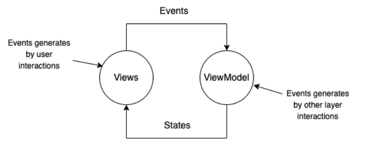

Это циклическое сообщение между представлением и ```ViewModel```. Поток информации следует только в одном
направление, отсюда и название паттерна «Однонаправленный поток данных».

Внешние факторы, которые могут вносить события в этот цикл, - это взаимодействия с пользователем, такие как прокрутка списка, нажатие кнопки
щелчок на кнопке, а также взаимодействие с другими уровнями приложения, например ответ от хранилища или
ответ от пользователя, фоновый таймер или, возможно, поступление push-уведомления.

Цикл не может быть прерван, поскольку любое прерывание или задержка приведут к ухудшению пользовательского опыта.
Пользователь будет воспринимать приложение как медленное, заблокированное и некачественное.
Поэтому при проектировании следует по возможности учитывать следующие правила:

- Составной элемент, определяющий представление, должен быть идемпотентным и функциональным.
- На стороне представления не должно быть задач, замедляющих цикл. Любая задача, требующая длительной обработки
должна быть делегирована ``ViewModel``, которая, благодаря реактивному программированию и ```Flow Coroutines```, будет
выполнять эти задачи асинхронно


Теперь, когда вы имеете представление о потоке данных и сообщений, которыми обмениваются ```View``` и ```ViewModel```,
логично спросить:

> Как реализован канал связи между View и ViewModel?
Мы рассмотрим это далее.


Давайте соединим компоненты View и ViewModel
Как показано на рисунке 4, два типа каналов связи, которые необходимо реализовать, четко определены
определены.

Первый канал - это канал событий, который идет в направлении ```View``` -> ```ViewModel```.

Для этой реализации требуется только, чтобы ```ViewModel``` раскрывала публичные операции, которые могут быть вызваны
которые могут быть вызваны представлением, как показано в следующем фрагменте кода 4.

```kotlin
//UI's Events
fun onNameChange(): (String) -> Unit = {
  name = it
}

fun onPhoneChange(): (String) -> Unit = {
  phone = it
}
```

Второй канал - это канал состояний, который идет в направлении ```ViewModel``` -> ```View```.

> Как пользовательский интерфейс узнает, что состояние изменилось?
Наблюдая за состояниями. Чтобы следить за состояниями, сначала ViewModel должна показать их UI через компонент
mutableStateOf, например:

```kotlin
 // UI's states
 var name by mutableStateOf("")
 private set
 var phone by mutableStateOf("")
 private set
```

```mutableStateOf``` не только позволит отображать состояние для представления, но и позволит представлению
подписаться на уведомление о любых изменениях в этом состоянии.
Давайте посмотрим на полную реализацию ViewModel и View (Composable):

```kotlin
class OrderViewModel : ViewModel() {
    // UI's states
    var name by mutableStateOf("")
    private set
    var phone by mutableStateOf("")
    private set

    //UI's Events
    fun onNameChange(): (String) -> Unit = {
        name = it
    }

    fun onPhoneChange(): (String) -> Unit = {
        phone = it
    }

    fun payOrder(): () -> Unit = {
        println("Order generated for $name and $phone")
    }
}
```


```kotlin
 @Composable
    fun OrderScreen(viewModel: OrderViewModel = viewModel()) {

        ContactInformation(
            name = viewModel.name,
            onNameChange = viewModel.onNameChange(),
            phone = viewModel.phone,
            onPhoneChange = viewModel.onPhoneChange(),
            payOrder = viewModel.payOrder()
        )
    }

    @Composable
    fun ContactInformation(
        name: String,
        onNameChange: (String) -> Unit,
        phone: String,
        onPhoneChange: (String) -> Unit,
        payOrder: () -> Unit
    ) {


        Column(
            modifier = Modifier
                .fillMaxSize()
                .padding(8.dp),
            horizontalAlignment = Alignment.CenterHorizontally
        ) {
            TextField(
                label = {
                    Text("User name")
                },
                value = name,
                onValueChange = onNameChange
            )
            Spacer(Modifier.padding(5.dp))
            TextField(
                label = {
                    Text("Phone number")
                },
                value = phone,
                onValueChange = onPhoneChange
            )
            Spacer(Modifier.padding(5.dp))
            Button(
                onClick = payOrder,
            ) {
                Text("Pay order")
            }
        }
    }
```

До сих пор мы видели, что состояния, такие как имя и телефон, являются представлениями переменной ```String```; то есть состояние представляет собой примитивную переменную. Однако мы можем расширить представление состояния на компоненты и
экранов.

В следующем разделе мы рассмотрим другие варианты представления состояний.

# Структуры, представленные в виде состояний

В Compose и в декларативных представлениях в целом состояния могут представлять различные типы структур пользовательского интерфейса, как показано на рисунке 5 ниже.

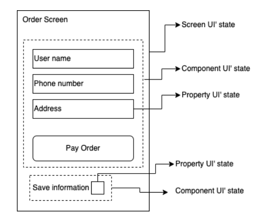

- Свойство состояния пользовательского интерфейса: Это примитивные переменные, представленные в виде состояний. На рисунке 5 к этому типу относятся поля ввода текста, такие как имя, телефон или адрес. 

- Состояние компонентного пользовательского интерфейса: Представляют собой состояния, связанные с компонентом, который группирует связанные элементы пользовательского интерфейса. Например, на экране заказа компонент под названием ```ContactInformationForm``` может группировать необходимые данные, такие как контактная информация. Этот компонент может иметь состояния NameValueChanged, PhoneValueChanged и SuccessValidated. - Состояние пользовательского интерфейса экрана: Представляет собой состояния, связанные с экраном, которые можно рассматривать как абсолютные и независимые состояния; например, экран под названием ```OrderScreen``` может иметь следующие состояния: Загрузка, Загружен успешно или Загрузка не удалась. Теперь давайте посмотрим, какие варианты реализации существуют в Android и Kotlin для определения этих состояний.

Свойство состояния UI - это состояние, объявленное на основе переменной примитивного типа, такой как String, Boolean, List или Int, среди прочих. Если оно объявлено во ViewModel (ViewModel как источник истины), то его определение может выглядеть следующим образом:

```kotlin
var name by mutableStateOf("")
private set

var phone by mutableStateOf("")
private set

var address by mutableStateOf("")
private set

var payEnable by mutableStateOf(false)
private set
```

Если он объявлен в View (View как источник истины), то его определение в Composable может быть таким:

```kotlin
var name by remember { mutableStateOf("") }
var phone by remember { mutableStateOf("") }
var address by remember { mutableStateOf("") }
var payEnable by remember { mutableStateOf(false) }
```

remember - это свойство Composable, которое позволяет временно удерживать состояние переменной во время рекомпозиции. Поскольку это Composable, данное свойство может быть определено только в декларативных представлениях, то есть в Composable-функциях. Всегда помните, что для использования делегирования через «by» необходимо импортировать:

```kotlin
import androidx.compose.runtime.getValue
import androidx.compose.runtime.setValue
```

В предыдущих примерах мы говорили только о представлении свойств или переменных через состояния с помощью компонента ```mutableStateOf```. Однако возможно также, что потоки данных могут быть представлены в виде состояний и наблюдаться с помощью Composables. Эти дополнительные возможности связаны с Flow, LiveData и RxJava.


# Состояние компонента пользовательского интерфейса 

Когда у вас есть набор взаимосвязанных элементов пользовательского интерфейса, их состояния могут быть сгруппированы в единую структуру или компонент пользовательского интерфейса с единым состоянием. Например, на рисунке 5 элементы Имя пользователя, Номер телефона, Адрес и даже Кнопка оплаты заказа могут быть сгруппированы в один компонент пользовательского интерфейса, а их состояния представлены в одном состоянии, которое называется, например, FormUiState.


```kotlin
data class FormUiState(
    val nameValueChanged: String = "",
    val phoneValueChanged: String = ""
    val addressValueChanged: String = ""
)

 val FormUiState.successValidated: Boolean get() = nameValueChanged.length > 1  && phoneValueChanged.length > 3
```

В этом случае моделирование нескольких состояний в объединенном классе состояний работает очень хорошо, поскольку переменные связаны между собой и даже определяют значение других переменных. Например, это происходит с переменной successValidated, которая зависит от переменных nameValueChanged и phoneValueChanged. Консолидация состояний повышает эффективность реализации, централизует управление и упорядочивает код. Именно этот прием будет чаще всего использоваться в нашей реализации. 

# Состояние экранного пользовательского интерфейса 

Если требуется смоделировать состояния, которые могут быть независимыми и принадлежать к одному семейству, можно использовать следующее определение

```kotlin
sealed class OrderScreenUiState {
data class Success(val order: Order): OrderScreenUiState()
data class Failed(val message: String): OrderScreenUiState()
object Loading: OrderScreenUiState()
 }
```

Такой тип реализации уместен при работе с абсолютными и эксклюзивными состояниями; вы имеете одно состояние или другое, но не оба одновременно. Как правило, простые экраны такого типа, такие как OnboardignScreen или ResultScreen, могут быть смоделированы с помощью этих состояний. Если экран более сложный и содержит множество элементов пользовательского интерфейса, которые работают независимо и имеют множество взаимосвязей, я рекомендую читателю предпочесть определение состояний с помощью методов Property UI' state и Component UI' state.

## Моделирование и группировка событий

Возвращаясь к примеру с экраном заказа, мы рассмотрим моделирование событий и то, как их группировать по аналогии с состояниями. Рассмотрим экран, подобный тому, что показан на следующем рисунке 6:

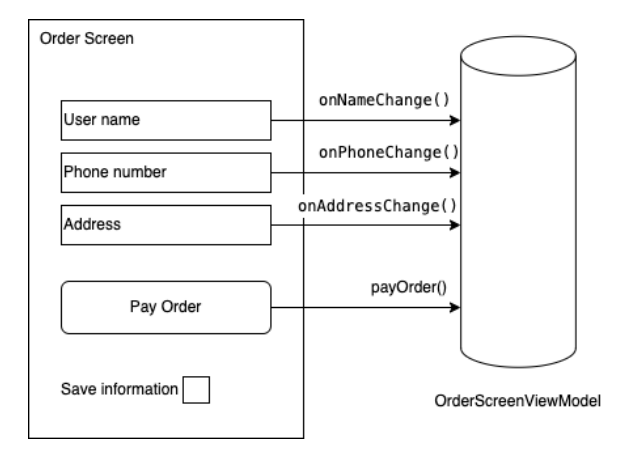

ViewModel передает представлению четыре операции (события), каждая из которых используется элементом пользовательского интерфейса View. Анализ этих четырех событий связан с формой для ввода контактной информации пользователя, поэтому имеет смысл сгруппировать их в один тип событий, как показано на следующем рисунке 7:

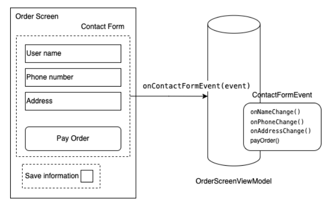

Реализация для представления различных типов событий может быть такой:

```kotlin
sealed class ContactFormEvent {
data class OnNameChange(val name: String): FormUiEvent()
data class OnPhoneChange(val phone: String): FormUiEvent()
data class OnAddressChange(val address: String): FormUiEvent()
object PayOrder: FormUiEvent()
 }
```

Наконец, не стоит так строго подходить к упрощению состояний или событий. Необходимо проанализировать преимущества и недостатки каждого использования и принять соответствующие решения. Для связанных компонентов пользовательского интерфейса их группировка имеет большой смысл; для некоторых других сквозных элементов полезнее оставить их независимыми. 


# Резюме 

В этой первой главе мы рассмотрели основные концепции, используемые в современной разработке приложений для Android. Такие понятия, как ```состояния``` и ```события```, ```подъем состояний```, ```источник истины``` и ```однонаправленный поток данных```, необходимо понять перед внедрением Jetpack Compose, ViewModels и других архитектурных компонентов, доступных для Android. Именно по этой причине мы начали с этих понятий в этой первой главе. В следующих главах мы рассмотрим определения архитектуры и дизайна в мобильном приложении, для чего будем использовать концепции, представленные в этой главе, в качестве справочника. В дальнейшем будет реализовано мобильное приложение под названием «Заказать сейчас», использующее в качестве концепции электронную коммерцию. В этом приложении будут присутствовать основные элементы электронной коммерции, такие как корзина, список товаров и процесс оформления заказа. Эта работа знакомит читателя с опытом проектирования и разработки, близким к реальному и продуктивному приложению. Но сначала мы применим концепции, изученные в этой главе, для реализации простой формы. Этому будет посвящена следующая глава, описанная ниже.


# Глава 2: Codelab - Практика работы с состояниями

Эта глава представляет собой лабораторную работу по применению концепций, изученных в ```главе 1: Принципы проектирования```.

Цель лабораторной работы заключается в следующих реализациях:

- Создайте приложение, использующее View в качестве источника истины.

- Модификация приложения для использования ViewModel в качестве источника истины.

- Группировка состояний и событий для упрощения обмена сообщениями между View и ViewModel.

Например, в этой лаборатории мы реализуем часть одного из экранов электронной коммерции. Эта электронная коммерция будет примером приложения, спроектированного и разработанного в книге ```Глава 3: OrderNow, A Real Application```. Экраном будет ```OrderScreen```, который содержит информацию о заказе, запрошенном пользователем, и другие контактные данные пользователя или покупателя. Для упрощения мы реализуем в лаборатории только часть экрана. Цель - отработать различные способы управления состояниями. В разделе «Оформление заказа» - глава 7 - читатель найдет полную реализацию экрана.


Задача состоит в том, чтобы реализовать форму с двумя полями:

- Имя пользователя
- Номер телефона.

Кроме того, кнопка «Оплатить заказ» будет включаться или выключаться в зависимости от правильности проверки полей «Имя пользователя» и «Номер телефона». Ниже показаны различные варианты реализации.

# View как источник истины 

Первый шаг - определить, какие элементы пользовательского интерфейса могут изменяться и представлять состояния на экране. В данном случае это будут: - Текстовое значение, введенное для имени пользователя. - Текстовое значение, введенное для номера телефона. - Включение/выключение свойства кнопки «Оплатить заказ». Поэтому в View (Composables) мы можем представить свойства следующим образом:

```kotlin
var name by remember { mutableStateOf("") }
var phone by remember { mutableStateOf("") }
```

А как насчет состояния (включить/выключить) свойства кнопки «Оплатить заказ»? В данном случае это состояние является производным от двух других состояний: имени и телефона. Поэтому это состояние не требует дополнительного определения. Код представления может выглядеть следующим образом:

```kotlin
@Composable
fun OrderScreen() {

var name by remember { mutableStateOf("") }
var phone by remember { mutableStateOf("") }

ContactInformation(
name = name,
onNameChange = { name = it },
phone = phone,
onPhoneChange = { phone = it })
}

@Composable
fun ContactInformation(
name: String,
onNameChange: (String) -> Unit,
phone: String,
onPhoneChange: (String) -> Unit
) {

Column(
modifier = Modifier
.fillMaxSize()
.padding(8.dp),
 horizontalAlignment = Alignment.CenterHorizontally,
 ) {
 TextField(
 label = {
 Text("User name")
 },
 value = name,
 onValueChange = onNameChange
 )
 Spacer(Modifier.padding(5.dp))
 TextField(
 label = {
 Text("Phone number")
 },
 value = phone,
 onValueChange = onPhoneChange
 )
 Spacer(Modifier.padding(5.dp))
 Button(
 onClick = {
 println("Order generated for $name and phone $phone")
 },
 enabled = name.length > 3 && phone.length > 4
 ) {
 Text("Pay order")
 }
 }
 }
```

А как насчет событий? В данном примере экрана идентифицированными событиями являются: - Событие при изменении «Имени пользователя». - Событие при изменении «Номера телефона». - Событие при выборе (нажатии) кнопки «Оплатить заказ». Управление этими событиями осуществляется следующим образом:

```kotlin
//User name changed
onNameChange = { name = it }

 ...
 //Phone number changed
 onPhoneChange = { phone = it }

 //Pay order clicked
 Button(
 onClick = {
 println("Order generated for $name and phone $phone")
 },
 ...
 )
```

И состояния, и события управляются View, а это значит, что View - единственный источник истины на экране.


# «ViewModel» как источник истины 

Во втором варианте реализации мы представим еще один агент - ViewModel¹⁰. ViewModel, как я уже говорил в первой главе, - это архитектурный компонент, который мы должны включать в наши приложения. Этот компонент является ключом к разделению ответственности в представлениях и частью презентационного слоя мобильного приложения. ViewModel можно интегрировать двумя способами: с помощью ручной настройки или менеджера зависимостей.


В этой лабораторной работе мы включим его вручную, однако в главе 7: «Реализация функций» будет показано, как включить его через менеджер зависимостей Hilt¹¹. Как и в предыдущем варианте, первым делом необходимо определить состояния и события на экране. Поскольку они уже определены, следующим шагом будет передача их из View в ViewModel следующим образом:


```kotlin
class OrderViewModel : ViewModel() {

// UI's states
var name by mutableStateOf("")
private set
var phone by mutableStateOf("")
private set

//UI's Events
fun onNameChange(): (String) -> Unit = {
name = it
 }

fun onPhoneChange(): (String) -> Unit = {
phone = it
}

fun payOrder(): () -> Unit = {
println("Order generated for $name and phone $phone")
}
}

```

В предыдущем коде ViewModel мы видим определение состояний и событий. Как нам связать ViewModel с View? В представлении мы включаем определение ViewModel, и в то же время она инстанцируется следующим образом:

```kotlin
@Composable
fun OrderScreen(viewModel: OrderViewModel = viewModel()) {

ContactInformation(
    name = viewModel.name,
    onNameChange = viewModel.onNameChange(),
    phone = viewModel.phone,
    onPhoneChange = viewModel.onPhoneChange(),
    payOrder = viewModel.payOrder()
)
}
```

Пожалуйста, не забудьте! Чтобы включить ViewModel вручную, необходимо, чтобы в проекте были необходимые зависимости, которые Google документирует в ViewModel, объявляя зависимости¹²:

```kotlin
dependencies {
2 def lifecycle_version = "2.5.0-rc01"
3
4 // ViewModel
5 implementation "androidx.lifecycle:lifecycle-viewmodel-ktx:$lifecycle_version"
6
7 // ViewModel utilities for Compose
8 implementation "androidx.lifecycle:lifecycle-viewmodel-compose:$lifecycle_version"
9 }

```

Полная реализация этого представления будет выглядеть следующим образом: 

```kotlin
@Composable
2 fun OrderScreen(viewModel: OrderViewModel = viewModel()) {
3
4 ContactInformation(
5 name = viewModel.name,
6 onNameChange = viewModel.onNameChange(),
7 phone = viewModel.phone,
8 onPhoneChange = viewModel.onPhoneChange(),
9 payOrder = viewModel.payOrder()
10 )
11 }
12
13 @Composable
14 fun ContactInformation(
15 name: String,
16 onNameChange: (String) -> Unit,
17 phone: String,
18 onPhoneChange: (String) -> Unit,
19 payOrder: () -> Unit
20 ) {
21
22 Column(
    modifier = Modifier
24 .fillMaxSize()
25 .padding(8.dp),
26 horizontalAlignment = Alignment.CenterHorizontally
27 ) {
28 TextField(
29 label = {
30 Text("User name")
31 },
32 value = name,
33 onValueChange = onNameChange
34 )
35 Spacer(Modifier.padding(5.dp))
36 TextField(
37 label = {
38 Text("Phone number")
39 },
40 value = phone,
41 onValueChange = onPhoneChange
42 )
43 Spacer(Modifier.padding(5.dp))
44 Button(
45 onClick = payOrder,
46 enabled = name.length > 3 && phone.length > 4
47 ) {
48 Text("Pay order")
49 }
50 }
51 }
```

В этом втором варианте реализации мы видим, что и состояния, и события делегируются ViewModel; таким образом, ViewModel становится источником истины. С изменением источника истины дизайн приобретает гибкость в применении централизованной бизнес-логики или логики представления к ViewModel. На данный момент у нас есть правильная и рабочая реализация. Но ее можно улучшить за счет определения состояния компонентного пользовательского интерфейса, как мы увидим далее. 


# Группировка «состояний» 

В приведенном выше примере видно, что поля являются частью формы. Даже состояние кнопки зависит от полей формы. Поэтому имеет смысл сгруппировать эти элементы пользовательского интерфейса в один содержащий их элемент пользовательского интерфейса. Поскольку в примере всего три элемента пользовательского интерфейса, преимущества их группировки могут быть не столь очевидны; однако давайте подумаем об экране, на котором есть множество других разделов с множеством других элементов пользовательского интерфейса. Прежде всего, нужно сгруппировать состояния в структуре FormUiState следующим образом: 


```kotlin
data class FormUiState(
2 val name: String = "",
3 val phone: String = ""
4 )
5
6 val FormUiState.successValidated: Boolean get() = name.length > 3
7 && phone.length > 4
```

Читатель заметит, что группировка событий похожа на технику, описанную в разделе «Состояние экранного пользовательского интерфейса» первой главы. Помните, что это применимо, поскольку различные типы событий, которые мы определяем, связаны между собой, но могут быть взаимоисключающими и независимыми. В ViewModel сообщения упрощаются до одного следующим образом:

```kotlin
class OrderViewModel : ViewModel() {
2
3 // UI's states
4 var formUiState by mutableStateOf(FormUiState())
5 private set
6
7 //UI's Events
8 fun onFormEvent(formEvent: FormUiEvent) {
9 when (formEvent) {
10 is FormUiEvent.OnNameChange -> {
11 formUiState = formUiState.copy(name = formEvent.name)
12 }
13 is FormUiEvent.OnPhoneChange -> {
14 formUiState = formUiState.copy(phone = formEvent.phone)
15 }
16 is FormUiEvent.PayOrderClicked -> {
17 println("Sending form with parameters:
18 ${formUiState.name} and ${formUiState.phone}")
19 }
20 }
21 }
22 }
```

С точки зрения View, реализация будет такой:

```kotlin
@Composable
2 fun OrderScreen(viewModel: OrderViewModel = viewModel()) {
3
4 ContactInformation(
5 name = viewModel.formUiState.name,
6 onNameChange = { viewModel.onFormEvent(FormUiEvent.OnNameChange(it)) },
7 phone = viewModel.formUiState.phone,
8 onPhoneChange = { viewModel.onFormEvent(FormUiEvent.OnPhoneChange(it)) },
9 payOrder = { viewModel.onFormEvent(FormUiEvent.PayOrderClicked) },
10 isValidPayOrder = viewModel.formUiState.successValidated
11 )
12 }
13
14 @Composable
15 fun ContactInformation(
16 name: String,
17 onNameChange: (String) -> Unit,
18 phone: String,
onPhoneChange: (String) -> Unit,
20 payOrder: () -> Unit,
21 isValidPayOrder: Boolean
22 ) {
23
24 ...
25 }
```

Дополнительный бонус 

Некоторые читатели, возможно, заметили, что я поместил логику проверки полей в структуру состояния FormUiState. Поскольку логика зачастую сложнее, чем проверка длины символов, лучше всего делегировать задачу проверки и валидации во ViewModel. Итак, следующие изменения добавлены во ViewModel и FormUiState:

```kotlin
// Business's logic or maybe some UI's logic for update the state
2 companion object {
3 fun applyLogicToValidateInputs(name: String, phone: String): Boolean {
4 return name.length > 1 && phone.length > 3
5 }
6 }
```

```kotlin
data class FormUiState(
2 val name: String = "",
3 val phone: String = ""
4 )
5
6 val FormUiState.successValidated: Boolean get() =
7 OrderViewModel.applyLogicToValidateInputs(name, phone)
```

Теперь вся логика находится на стороне ViewModel. 


# Резюме 

В этой главе мы рассмотрели способы управления состояниями и событиями, используя представления или ViewModel в качестве источника истины. Кроме того, мы использовали некоторые приемы для лучшей организации состояний и событий в структурах; для более организованной и простой реализации. В следующей главе мы рассмотрим приложение «Заказать сейчас», электронную коммерцию, которое мы будем реализовывать на протяжении всей книги, чтобы объяснить концепции и методы разработки современных приложений для Android.


# Глава 3: OrderNow, реальное приложение 


## О приложении 

```OrderNow``` - это пример минимального жизнеспособного продукта (MVP) мобильного приложения для электронной коммерции, которое мы будем разрабатывать и реализовывать на протяжении всей этой книги. Мы будем использовать это приложение в качестве примера для применения концепций, изученных в каждой главе книги. Реализация решения для электронной коммерции позволит нам ближе познакомиться с задачами, которые ставит перед нами точное и продуктивное приложение. Ниже перечислены основные функции электронной коммерции, которые мы будем развивать в ```OrderNow```:
- Представление списка категорий.
- Представление списка товаров по категориям.
- Представление подробной информации о конкретном продукте.
- Управление товарами (добавление и удаление) в корзине.
- Просматривать список товаров, выбранных для покупки.
- Заполнение информации и данных для совершения покупки (оформление заказа).
- Моделирование процесса оплаты. 

# Экраны 

Экранами, относящимися к различным функциональным возможностям, являются:

- Главная 
- Список товаров 
- Детали товаров 
- Корзина 
- Оформление заказа 
- Размещение заказа


# Home, Product List and Product Detail


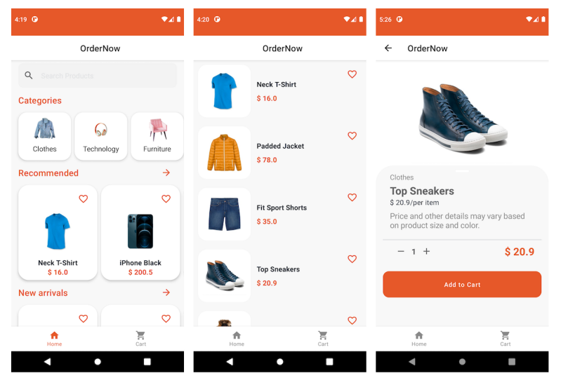


# Cart and Checkout

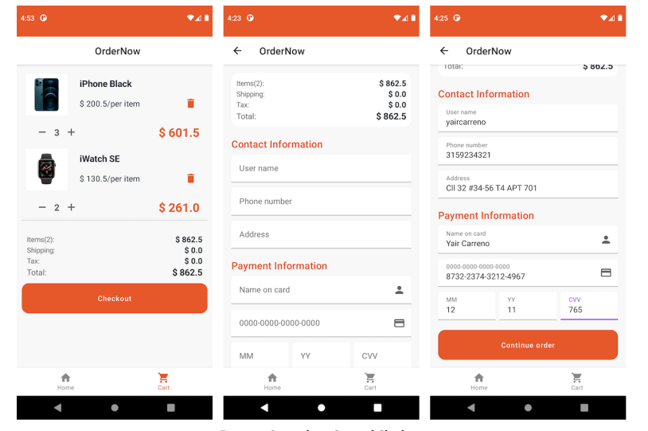

# Place Order


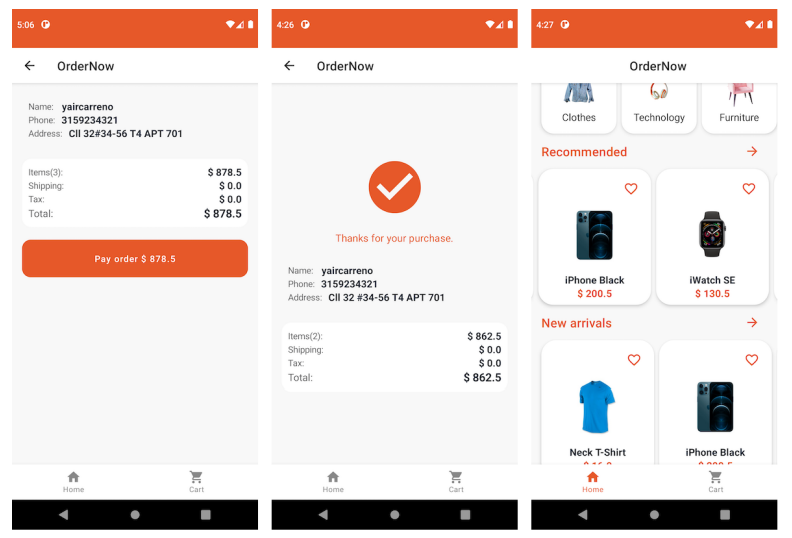


# Технологии

Этот раздел представляет собой краткое изложение технических характеристик OrderNow, чтобы читатель знал, какие инструменты
и руководство по проектированию, которые будут использоваться при реализации.
Помните, что это предложение по внедрению. Читатель может самостоятельно принять решение о замене или включении
другой инструмент, с которым у него есть опыт или с которым ему удобно работать.

# Руководство по проектированию и архитектуре
В главах «Глава 1: Принципы проектирования» и «Глава 4: Архитектура приложения» документируются рекомендации по проектированию и
архитектуры, то есть минимальной жизнеспособной архитектуры (MVA)¹⁶, которая будет использована для разработки OrderNow.
использована для разработки OrderNow.


Компоненты архитектуры 

- Compose¹⁷: Это будет фреймворк для реализации декларативных представлений в нашем презентационном слое. 
- ViewModel¹⁸: Архитектурный компонент в слое представления, который мы используем для инкапсуляции бизнес-логики. 
- Flow¹⁹: Мы будем использовать корутины Flow для реактивного программирования в нашем приложении. Flow позволит сообщениям между компонентами приложения, как синхронным, так и асинхронным, выполняться наиболее оптимальным образом. 
- Навигация²⁰: Архитектурный компонент, который мы будем использовать для реализации навигации по различным экранам нашего приложения. 

# Зависимости 
- Coil²¹: Библиотека для загрузки удаленных или локальных изображений в наше APP, на языке Kotlin и с поддержкой Jetpack Compose. 

За рамками книги 

Некоторые темы исключены из содержания книги не потому, что они менее важны, а скорее для того, чтобы сузить рамки и достичь конкретных целей. Попытка охватить все связанные с Android-приложением темы может привести к чрезмерному расширению содержания и отвлечь нас от основных концепций, которые должны быть ясны с самого начала. 
Следующие возможности не включены и выходят за рамки примера MVP:

 - Руководство по проектированию UI/UX.
 - Компоненты аутентификации и авторизации.
 - Тестирование. 
 - Доступность. 
 
 # Резюме 
 
 В этой небольшой главе кратко описаны технологии и компоненты, использованные при реализации ```OrderNow```. Читатель не только получит исходный код и попытается угадать, как он был построен, но и узнает о каждом решении, принятом на дизайнерском и техническом уровнях реализации. В следующей главе я опишу архитектуру и проектные решения в примере App.


# Глава 4: Архитектура приложения

Выбор стиля Архитектура, которой мы будем следовать при создании OrderNow, основана на передовом опыте и архитектурном руководстве, рекомендованном Google в Guide to app architecture²². Эти определения включают некоторые принципы Clean Architecture²³ для определения компонентов на различных уровнях. Определение слоев В приложении мы определим следующие основные слои: 

- ```UI Layer``` 
- ```Domain Layer``` 
- ```Data Layer``` 

## UI Layer 

Этот слой группирует элементы пользовательского интерфейса, представления (композитные функции), ViewModels и утилиты презентационного слоя, такие как приложения формата и анимации. При проектировании этого слоя необходимо учитывать следующие моменты:


При работе с состояниями следуйте принципам, описанным в главе 1:

Принципы проектирования.

 - Для каждого экрана будет реализована соответствующая ViewModel.
 - ViewModel также будут функционировать как держатели состояний, то есть менеджеры состояний.
 - Логика навигации будет делегирована представлению и будет зависеть от состояния APP.
 - Побочные эффекты должны сообщаться ViewModel.
 - ```ViewModel``` должны сохранять свои состояния при изменении конфигурации
 - Приветствуется использование представлений без состояния.

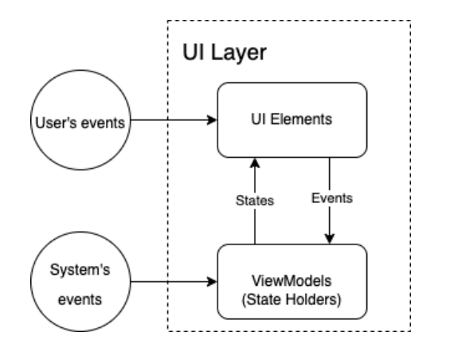


## Слой домена 


Хотя этот слой может быть необязательным, я рекомендую его включить, чтобы сохранить дизайн, соответствующий разделению обязанностей, продиктованному Clean Architecture. Этот слой группирует компоненты, называемые UseCases, которые управляют бизнес-логикой и всей той логикой, которую могут повторно использовать ViewModels. Этот слой также служит мостом между слоем пользовательского интерфейса и слоем данных. Компоненты типа Models также относятся к этому слою. Эти компоненты моделируют сущности или структуры данных, используемые слоем представления или слоем домена. Например, в OrderNow и Product, и Category представляют собой модели или сущности.

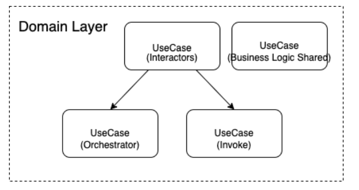


При проектировании этого слоя следует учитывать следующие соображения:

- Вся логика представления, дублируемая в представлениях, может быть помещена в UseCase.
- Компоненты, принадлежащие к этому слою, могут быть stateless; это компоненты, не требующие временного сохранения.
- Операции, выполняемые UseCase, должны быть безопасными для основной части.

- UseCases могут взаимодействовать друг с другом для организации операций use case.
- Каждый UseCases отвечает за одну и только одну операцию.
- Каждый UseCases может использовать один или несколько репозиториев.


## Уровень данных 

На этом уровне сгруппированы компоненты, называемые репозиториями, которые организуют и инкапсулируют логику интеграции с локальными и удаленными источниками данных. Как следует из названия, они следуют шаблону Repository²⁴. Другими компонентами этого слоя являются источники данных, мапперы и DTO. 

- Источник данных: Содержит логику интеграции с внешними или локальными источниками персистентности. 
- DTO: (Data Transfer Object)²⁵ Это структура, которая моделирует объект персистентности. Содержит определения, используемые механизмом персистентности. Чтобы другие уровни (UI и Domain) не унаследовали эти определения, эти типы сущностей переводятся в модели домена приложения с помощью мапперов. 
- Мапперы: Они преобразуют DTO в модели сущностей доменного слоя. 

При проектировании этого слоя рекомендуется учитывать следующие соображения: 

- Этот слой может использоваться в качестве источника истины. 
- Операции, выполняемые Репозиториями, должны быть безопасными для основных ресурсов. 
- Для каждого первичного типа сущности определяется один репозиторий, например, ProductRepository, CategoryRepository.

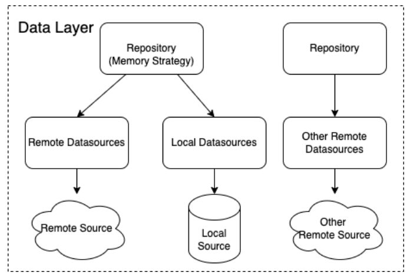

## Общая архитектура 

Общая схема с различными интегрированными слоями выглядит следующим образом:

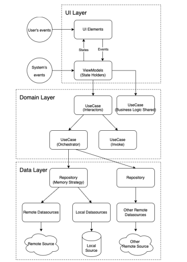


О других слоях Другими вспомогательными слоями, дополняющими основные слои архитектуры, будут: - Main: Содержит базовые артефакты приложения, такие как MainActivity, Application, ApplicationState и другие. - Общий: Содержит артефакты, относящиеся к различным приложениям, такие как определения навигации, утилиты, используемые для других слоев, менеджер зависимостей и т. д. По поводу использования портов Clean Architecture рекомендует включать порты между границами различных слоев²⁶. Эта техника позволяет инвертировать управление, развязывая компоненты, которые взаимодействуют между границами каждого слоя. Такой подход повышает уровень ремонтопригодности и адаптивности конструкции. В нашем примере приложения (OrderNow) будут добавлены порты между слоем домена и слоем данных


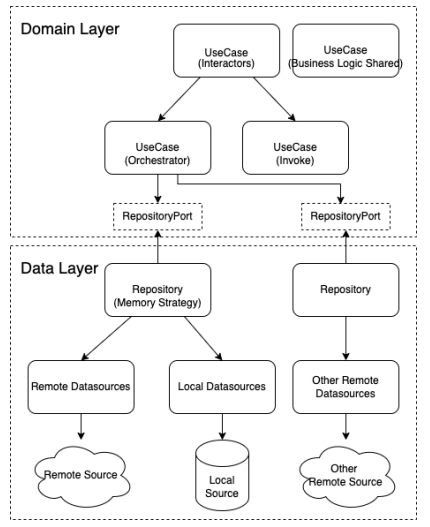


# Организация каталогов 


В нашем примере OrderNow для простоты слои будут организованы монолитно через каталоги в одном модуле. Я оставляю на усмотрение читателя, если позже в своих проектах он решит разделить слои, выделив для каждого из них отдельный модуль. Организация по каталогам осуществляется с помощью двух определений: - В слое UI будет использоваться организация по функциям. - В Domain Layer и Data Layer будет использоваться организация по компонентам.


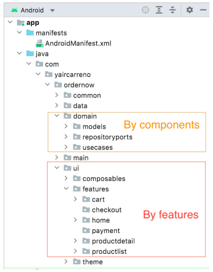


Номенклатура и элементы именования 

Для именования компонентов мы будем использовать следующие правила Использование суффиксов Суффикс будет использоваться в имени компонента только в том случае, если:

- По имени содержащего пакета нельзя определить его тип.
- Необходимо указать тип структуры, которую представляет компонент, например ProductRepository.
- Чтобы избежать путаницы между типами компонентов, например, модель может называться Category, а ее хранилище - CategoryRepository. 

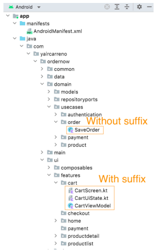

Именование пакетов Имена пакетов приложений должны быть строчными, без разделителей и заглавных букв.

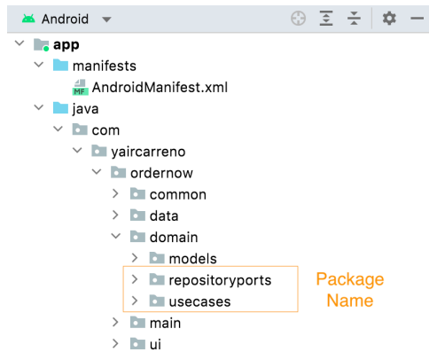


Именование компонентов Для названия компонентов типа UseCases в качестве префикса используется действие, представляющее операцию в случае использования (do, get, update, save, send, delete, add).


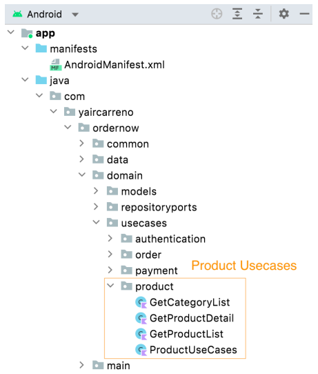

## Именование композитных функций

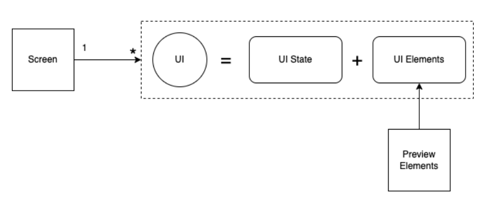

Для определения компонентов пользовательского интерфейса, то есть функций Composables, будут использоваться следующие обозначения, за основу которых взята документация Google²⁷ в руководстве по архитектуре: Screen: Суффикс, используемый для композитов, которые представляют весь экран. UI: Суффикс, используемый для компонентов, которые объединяют состояния представления (UI State) с графическим представлением компонентов (UI Elements). Elements: Суффикс, используемый для составных элементов, определяющих компоненты библиотеки пользовательского интерфейса (кнопки, макеты, флажки, текстовые поля и т. д.), из которых состоит представление. Preview: Префикс, используемый для композитов предварительного просмотра представлений (Elements). Составные элементы экрана и пользовательского интерфейса также могут быть предварительно просмотрены, но это становится более сложным из-за зависимости от состояний и других переменных. Следует помнить, что могут быть исключения, когда не обязательно определять все типы композитов и опускать определение некоторых. В зависимости от степени сложности экранов будет решено, какие из них применимы, а какие нет. 

# Резюме 

В этой главе я хотел описать определения архитектуры, которым необходимо следовать перед началом реализации. Также были разъяснены правила, используемые для организации проекта приложения. Должен оговориться, что определения, приведенные в этой главе, являются рекомендациями. Читатель сможет внести свои коррективы или использовать те соглашения и правила, которые ему больше подходят или с которыми он чувствует себя комфортно в своих реализациях. В следующей главе мы приступим к реализации ```OrderNow```, и первое, что будет построено, - это его скелет, то есть основная структура. 


# Глава 5: Скелет: Основная структура Создание экранов и ViewModels 


В предыдущих главах мы уже разобрали теоретические концепции и организацию, которую мы придадим проекту OrderNow. В этой главе мы начнем с реализации начальной структуры и шаблона, который будет объединять все части приложения. 

Первым шагом будет добавление следующих основных экранов с соответствующими ViewModels:

- Главная 
- Список товаров 
- Детализация товаров 
- Корзина 

Пример добавленных элементов показан на следующем рисунке 5.1:

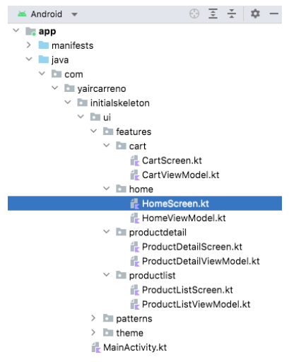


Мы будем использовать менеджер зависимостей Hilt²⁹ в приложении, чтобы привязать каждую ViewModel к соответствующему экрану.
Для этого мы должны сначала установить Hilt в приложение, как указано в статье Google Установка Hilt³⁰.
В процессе установки Hilt будет запрошено определение класса типа Application, который в
нашем примере это будет OrderNowApplication, как показано ниже:


```kotlin
@HiltAndroidApp
2 class OrderNowApplication: Application()
```
Не забудьте также зарегистрировать класс OrderNowApplication в файле AndroidManifiest.xml: 

```xml
<application
2 android:name=".main.OrderNowApplication"
3 android:allowBackup="true"
4 ... >

```

Кроме того, мы устанавливаем в проект библиотеку Navigation Compose, которая позволит представлению (Composable) получать экземпляр соответствующей ViewModel во время навигации:

```
dependencies {
2 implementation 'androidx.hilt:hilt-navigation-compose:1.0.0'
3 }
```

После того как предыдущая настройка в проекте выполнена правильно, мы можем внедрить ViewModel в представление следующим образом³¹:

```kotlin
@HiltViewModel
2 class HomeViewModel @Inject constructor() : ViewModel() {
3 ...
4 }
```

```kotlin
@Composable
2 fun HomeScreen(viewModel: HomeViewModel = hiltViewModel()
3 ) {
4 ...
5 }
```

Каждый экран будет связан с соответствующей ViewModel через менеджер зависимостей Hilt. До этого момента мы интегрировали следующие компоненты архитектуры: Compose, Navigation и ViewModel. Это идеальное сочетание инструментов с помощью Jetpack, и в последующих главах мы увидим его потенциал в мобильной разработке. Спасибо, команда Google, вы лучшие!


# Паттерны пользовательского интерфейса: TopAppBar и BottomAppBar 


С помощью компонента Scaffold мы можем реализовать в наших приложениях два наиболее распространенных паттерна пользовательского интерфейса в Material Design: TopAppBar и BottomAppBar. Scaffold³³ - это детальное представление (композитное), которое позволит нам реализовать эти паттерны следующим образом: 

```kotlin
Scaffold(
2 topBar = {
3 TopAppBar { /* Top app bar content */ }
4 },
5 bottomBar = {
6 BottomAppBar { /* Bottom app bar content */ }
7 }
8 ) { contentPadding ->
9 // Screen content
10 }
```
Легко, не правда ли? В фрагменте кода 5.6 мы определяем topBar, bottomBar и (еще не добавленное) содержимое экрана. В Scaffold секции topBar и bottomBar являются необязательными; то есть определение некоторых из этих частей можно опустить. Кроме того, в Scaffold есть еще два компонента, которые мы можем объявить:

- scaffoldState - snackbarHost В следующей главе мы увидим, как используется каждый из них. А сейчас давайте ограничимся определением topBar и bottomBar. Теперь, когда мы знаем, как включить эти шаблоны пользовательского интерфейса в наше приложение, следующим шагом будет создание представлений (composables), представляющих TopAppBar и BottomAppBar. Организуется каталог под названием patterns, и в него добавляются два представления, OrderNowTopBar и OrderNowBottomBar, следующим образом: 

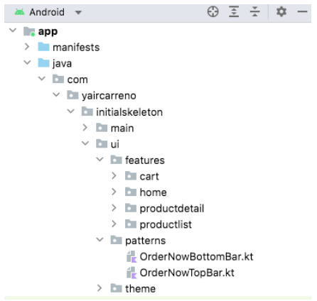


# OrderNowTopBar 

Реализация OrderNowTopBar очень проста. Изначально нам нужно реализовать его следующим образом:

```kotlin
@Composable
2 fun OrderNowTopBar() {
3 TopAppBar(
4 title = {
5 Text(
6 text = stringResource(id = AppString.app_name),
7 textAlign = TextAlign.Center,
8 modifier = Modifier.fillMaxWidth()
9 )
10 },
backgroundColor = MaterialTheme.colors.background,
12 contentColor = contentColorFor(MaterialTheme.colors.background)
13 )
14 }
```

Предыдущая реализация пока не содержит таких элементов, как опция возврата назад; однако в разделе «Добавление „Назад“ на панель TopAppBar» в главе 7 она будет включать такую опцию навигации с помощью стратегии, использующей состояние.


# OrderNowBottomBar 

Реализация OrderNowBottomBar может быть немного более сложной, поскольку нам нужно включить навигацию между экранами. Однако мы оставим эту деталь реализации для следующей главы, Navegación en la aplicación. Пока же мы приведем статическое определение без навигации.


```kotlin
@Composable
2 fun OrderNowBottomBar() {
3 val selectedIndex = remember { mutableStateOf(0) }
4 BottomNavigation(
5 backgroundColor = MaterialTheme.colors.background,
6 contentColor = contentColorFor(MaterialTheme.colors.background),
7 elevation = 10.dp
8 ) {
9 BottomNavigationItem(icon = {
10 Icon(imageVector = Icons.Default.Home, "")
11 },
12 label = { Text(text = "Home") },
13 selected = (selectedIndex.value == 0),
14 unselectedContentColor = Color.Gray,
15 selectedContentColor = orange,
16 onClick = {
17 selectedIndex.value = 0
18 })
19
20 BottomNavigationItem(icon = {
21 Icon(imageVector = Icons.Default.ShoppingCart, "")
22 },
23 label = { Text(text = "Cart") },
24 selected = (selectedIndex.value == 1),
25 unselectedContentColor = Color.Gray,
26 selectedContentColor = orange,
27 onClick = {
28 selectedIndex.value = 1
})
30 }
31 }
```

На данный момент у нас уже есть определения экранов, ViewModels и Scaffold (который включает OrderNowBottomBar и OrderNowTopBar). Следующий шаг - собрать все части воедино, и мы сделаем это в следующем разделе.


# Собираем все вместе 

Первой задачей является создание каталога под названием main. Эта директория будет сквозной и будет содержать базовые классы или структуры приложения. Внутри этой директории мы разместим класс Application, переместим туда MainActivity и главный экран приложения, который мы назовем OrderNowScreen, как показано на следующем изображении.

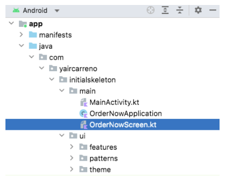

Теперь мы изменим класс MainActivity.kt так, чтобы он загружал экран входа в приложение OrderNowScreen следующим образом:

```kotlin
@AndroidEntryPoint
2 class MainActivity : ComponentActivity() {
3 override fun onCreate(savedInstanceState: Bundle?) {
4 super.onCreate(savedInstanceState)
5 setContent {
6 OrderNowScreen()
7 }
8 }
9 }
```

Затем в представлении OrderNowScreen мы определяем Scaffold нашего приложения следующим образом:

```kotlin
@Composable
2 fun OrderNowScreen() {
3 InitialSkeletonTheme {
4 Surface(
5 modifier = Modifier.fillMaxSize(),
6 color = MaterialTheme.colors.background
7 ) {
8 Scaffold(
9 topBar = { OrderNowTopBar() },
10 bottomBar = { OrderNowBottomBar() }
11 ) { contentPadding ->
12 println(contentPadding)
13 }
14 }
15 }
16 }
```

Когда вы запустите приложение, результат должен быть похож на следующее изображение:

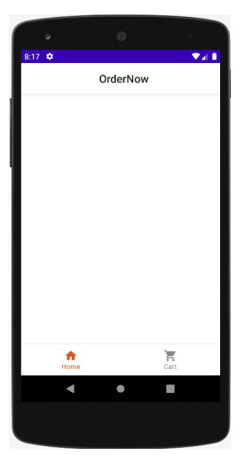

# Резюме

В этой главе мы создали начальную структуру проекта OrderNow. Определенные и реализованные здесь компоненты станут основой для продолжения работы над навигацией в следующей главе. По мере продвижения по главам мы будем улучшать реализацию каждого компонента OrderNow, чтобы в результате наша электронная коммерция была спроектирована и реализована наилучшим образом. 


# Глава 6: Проектирование навигации в приложении

В реализации, сделанной в предыдущей главе, «Скелет: Основная структура, было установлено несколько компонентов архитектуры Jetpack было установлено несколько компонентов архитектуры Jetpack, которые будут использоваться в этой главе.

Это такие компоненты, как ```Composables```, ```ViewModels```, ```Navigation``` и ```Hilt```. Кроме того, мы оставили базовую структуру, включающую шаблоны пользовательского интерфейса ```TopAppBar``` и ```BottomAppBar``` с помощью ```Scaffold```.

Чтобы продолжить совершенствование реализации, нам нужно добавить новую ключевую вкладку «Общее состояние приложения». 

## Состояние приложения: Общее состояние

В первой главе «Принципы проектирования» мы обсудили важную роль состояния в современных Android-приложениях.

Три типа состояний, которые могут существовать в дизайне: состояние пользовательского интерфейса свойств, состояние пользовательского интерфейса компонентов и состояние пользовательского интерфейса экрана состояние.

В дополнение к этим состояниям мы можем определить новый тип состояния - состояние App.
Это новое состояние будет определять общее состояние приложения. Оно будет использоваться для навигации между экранами, представления спонтанных сообщений (snackbars) и других доступных процессов в приложении.

В основной директории мы определим класс ```OrderNowState```, который будет нашим держателем состояния, который который будет представлять этот тип состояния.

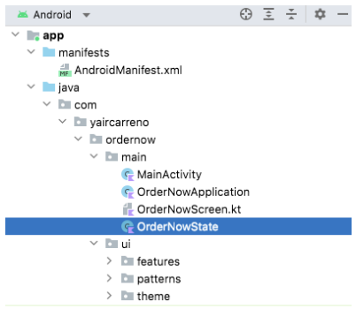

Далее мы выполним начальную реализацию ```OrderNowState``` следующим образом:

```kotlin
@Composable
2 fun rememberAppState(
3 scaffoldState: ScaffoldState = rememberScaffoldState(),
4 navController: NavHostController = rememberNavController(),
5 resources: Resources = resources(),
6 coroutineScope: CoroutineScope = rememberCoroutineScope()
7 ) = remember(
8 scaffoldState,
9 navController,
10 resources,
11 coroutineScope
12 ) {
13 OrderNowState(scaffoldState, navController, resources, coroutineScope)
14 }
15
16 class OrderNowState(
17 val scaffoldState: ScaffoldState,
18 val navController: NavHostController,
19 private val resources: Resources,
20 coroutineScope: CoroutineScope
21 )
```

А позже мы изменим наше представление ```OrderNowScreen```, чтобы включить в него ранее определенное состояние, как показано ниже:

```kotlin
@Composable
2 fun OrderNowScreen() {
3 OrderNowTheme {
4 Surface(
5 modifier = Modifier.fillMaxSize(),
6 color = MaterialTheme.colors.background
7 ) {
8 val appState = rememberAppState()
9 Scaffold(
10 scaffoldState = appState.scaffoldState,
11 topBar = { OrderNowTopBar() },
12 bottomBar = { OrderNowBottomBar() }
13 ) { contentPadding ->
14 println(contentPadding)
15 }
16 }
17 }
18 }
@Composable
21 @ReadOnlyComposable
22 fun resources(): Resources {
23 LocalConfiguration.current
24 return LocalContext.current.resources
25 }
```

Примечание: Также необходимо добавить в OrderNowScreen функцию resources, с помощью которой он будет обращаться к ресурсам
ресурсам приложения.
Ниже приведены строки кода, в которых можно выделить это изменение

```kotlin
val appState = rememberAppState()
2
3 Scaffold(
4 scaffoldState = appState.scaffoldState,
5 ...
6 ) { contentPadding ->
7 ...
8 }
```

С помощью приведенного выше кода мы можем указать ```Scaffold```, какое состояние он должен взять в качестве ссылки: состояние приложения. Это впоследствии позволит осуществлять последовательную навигацию между представлениями, представлять спонтанные сообщения,
и другие эксклюзивные задачи представления, принимающего в качестве источника истины только ```AppState```.

Теперь, когда состояние APP определено, мы можем приступить к реализации навигации приложения.


## Определение навигационной карты
Стратегия навигации, которую мы используем в приложении, состоит из следующих элементов:
- NavHost: Это компонент, отвечающий за отображение результата навигации в представлении. Адрес
Результат навигации определяется контроллером навигации и определениями, заданными в
графе навигации.
- AppSoGraph: Является реализацией графа навигации. Указывается представление или компонент, к которому он
должен направлять навигацию в соответствии с заданным маршрутом.

## Экранные маршруты:

Это различные экраны приложения, на которые можно попасть с помощью навигации. Это
Неважно, активируется ли навигация из меню опций, ссылки, кнопки или любого другого активного
агент. Каждый из этих экранов будет иметь уникальный маршрут, связанный с ним.

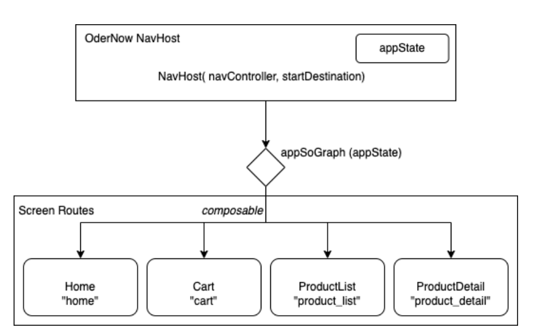

Далее мы рассмотрим, как включить каждый из этих элементов в OrderNow.


# OrderNowScreenRoute
Сначала создается новый каталог обхода под названием common -> navigation. В этот пакет мы добавляем класс под названием
```OrderNowScreenRoute``` следующим образом:

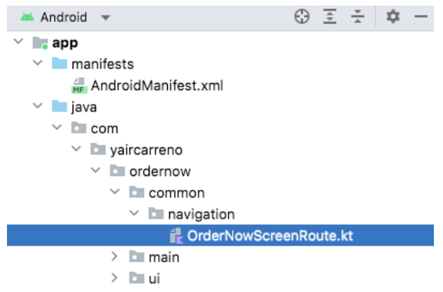

В рамках этого класса экраны, на которые можно переходить, определяются следующим образом:

```kotlin
sealed class OrderNowScreenRoute (val route: String) {
2
3 object Home : OrderNowScreenRoute("home")
4 object Cart : OrderNowScreenRoute("cart")
5 object ProductList : OrderNowScreenRoute("product_list")
6 object ProductDetail : OrderNowScreenRoute("product_detail")
7 }
```

# OrderNowNavHost y AppSoGraph

Теперь создадим класс ```OrderNowNavHost```, который будет представлять NavHost приложения следующим образом:

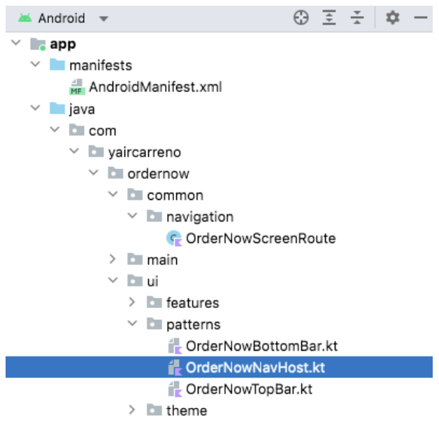


```kotlin

@Composable
2 fun OrderNowNavHost(appState: OrderNowState) {
3 NavHost(
4 navController = appState.navController,
5 startDestination = ...
6 ) {
7 appSoGraph(appState)
8 }
9 }
10
11 fun NavGraphBuilder.appSoGraph(appState: OrderNowState) {
    ...
13 }

```

Из предыдущего кода, фрагмента кода 6.5, следует выделить следующие определения:
- ```OrderNowNavHost``` требует знания состояния APP.
- ```NavController``` размещается и берется из состояния APP.
- Навигационная карта (```appSoGraph```), будет создана на основе состояния APP и является расширением, определенным
в ```OrderNowNavHost```.
Чтобы продолжить и закончить реализацию навигации в OrderNow, мы должны добавить вспомогательный класс
описанный ниже.


# NavigationBarSection

```NavigationBarSection``` - это вспомогательный класс, представляющий группу экранирования, которая составляет меню нижней панели
приложения.
Помните, что мы можем начать навигацию с действий в меню опций или других компонентов пользовательского интерфейса, таких как ссылки,
кнопки или внутренние перенаправления.

В следующем разделе мы сделаем изменения для внутренних перенаправлений (из кнопок, ссылок и т. д.), а пока,
давайте сосредоточимся на навигации из ```BottomBar```.

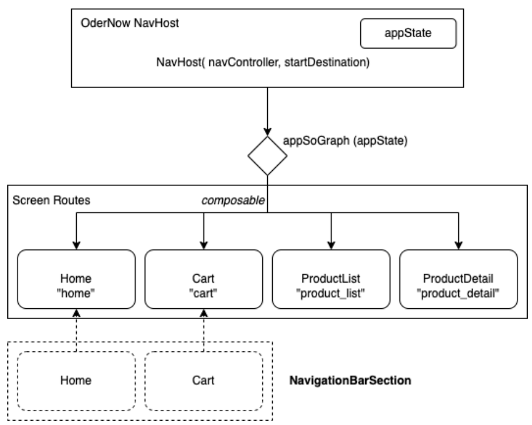

На рисунке 6.5 мы видим, как вспомогательный класс ```NavigationBarSection``` группирует только экраны ```Home``` и ```Cart```, которые мы хотим включить из меню ```BottomBar```.

Этот класс будет помещен в каталог навигации следующим образом:

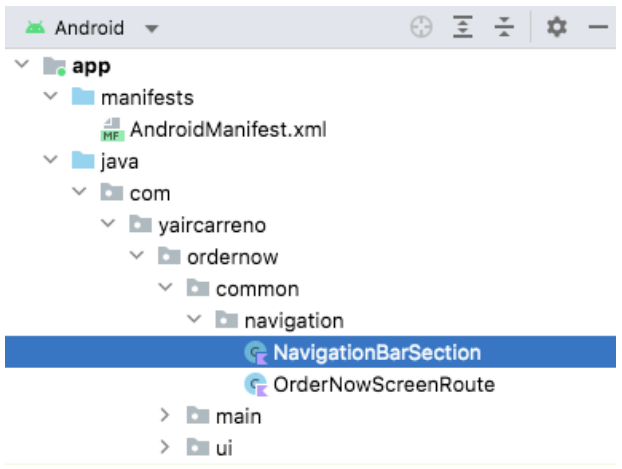

А его реализация будет выглядеть следующим образом:

```kotlin
sealed class NavigationBarSection(
2 @StringRes val title: Int,
3 val icon: ImageVector,
4 val route: String
5 ) {
6 companion object {
7 val sections = listOf(
8 Home,
9 Cart
10 )
11 }
12
13 object Home : NavigationBarSection(
14 title = AppText.home,
15 icon = Icons.Filled.Home,
16 route = OrderNowScreenRoute.Home.route
17 )
18
19 object Cart : NavigationBarSection(
20 title = AppText.cart,
21 icon = Icons.Filled.ShoppingCart,
22 route = OrderNowScreenRoute.Cart.route
23 )
24 }
```

Добавив в проект класс-помощник, мы обновляем класс OrderNowNavHost следующим образом:

```kotlin
@Composable
2 fun OrderNowNavHost(appState: OrderNowState, paddingValues: PaddingValues) {
3 NavHost(
4 navController = appState.navController,
5 startDestination = NavigationBarSection.Home.route,
6 modifier = androidx.compose.ui.Modifier.padding(paddingValues)
7 ) {
8 appSoGraph(appState)
9 }
10 }
11
12 fun NavGraphBuilder.appSoGraph(appState: OrderNowState) {
13
14 // Home Screen Graph
15 composable(NavigationBarSection.Home.route) {
16 HomeScreen()
17 }
18
19 // Cart Screen Graph
20 composable(NavigationBarSection.Cart.route) {
21 CartScreen()
22 }
23
24 // Product List Screen Graph
25 composable(OrderNowScreenRoute.ProductList.route) {
26 ProductListScreen()
27 }
28
29 // Product Detail Screen Graph
30 composable(OrderNowScreenRoute.ProductDetail.route) {
31 ProductDetailScreen()
32 }
33 }
```

В предыдущем фрагменте кода 6.7 реализация функции ```appSoGraph``` является расширением ```NavGraphBuilder```, и в ней мы задаем карту навигации для каждого экрана приложения.
Кроме того, через параметр ```startDestination``` указывается экран по умолчанию, который будет представлен первым, то есть главный экран.

Следующим шагом для внедрения изменений будет обновление класса ```OrderNowBottomBar``` следующим образом:

```kotlin
@Composable
2 fun OrderNowBottomBar(navController: NavHostController) {
3
4 val navBackStackEntry by navController.currentBackStackEntryAsState()
5 val currentDestination = navBackStackEntry?.destination
6 BottomNavigation(
7 backgroundColor = MaterialTheme.colors.background,
8 contentColor = contentColorFor(MaterialTheme.colors.background),
9 elevation = 10.dp
10 ) {
11 NavigationBarSection.sections.forEach { section ->
12 val selected =
13 currentDestination?.hierarchy?.any {
14 it.route == section.route
15 } == true
16 BottomNavigationItem(
17 icon = {
18 Icon(
19 imageVector = section.icon,
20 contentDescription = stringResource(section.title)
21 )
22 },
23 label = { Text(text = stringResource(section.title)) },
24 selected = selected,
25 unselectedContentColor = Color.Gray,
26 selectedContentColor = orange,
27 onClick = {
28 navController.navigate(section.route) {
29 popUpTo(navController.graph.findStartDestination().id) {
30 saveState = true
31 }
32 launchSingleTop = true
33 restoreState = true
34 }
35 })
36 }
37 }
38 }

```

Для каждого элемента, добавленного в секцию ```NavigationBarSection```, в ```BottomBar``` будет отображаться опция. Эта реализация ```OrderNowBottomBar``` чище, чем та, что была сделана в предыдущей главе 5: Skeleton: Главная
структуре.

Затем мы снова обновляем представление ```OrderNowScreen``` следующим образом:

```kotlin
@Composable
2 fun OrderNowScreen() {
3 OrderNowTheme {
4 Surface {
5 val appState = rememberAppState()
6 Scaffold(
7 ...
8 bottomBar = {
9 OrderNowBottomBar(navController = appState.navController)
10 }
11 ) { contentPadding ->
12 OrderNowNavHost(appState, contentPadding)
13 }
14 }
15 }
16 }

```
Теперь ```OrderNowBottomBar``` будет требовать ссылку на ```navController```, отвечающий за навигацию.

В секции содержимого ```Scaffold``` добавляется экземпляр ```OrderNowNavHost```, который получает в качестве параметра общий
статус APP в качестве параметра, как показано в фрагменте кода 6.8

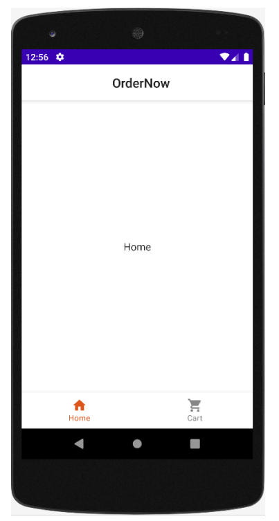

После этих изменений приложение должно запуститься, как показано на рисунке 6.7

# Навигация из других элементов пользовательского интерфейса


Теперь, когда у нас есть готовая реализация навигации из опций BottomBar, нам нужны
определения для навигации по приложению из других элементов пользовательского интерфейса, таких как кнопки, ссылки, глубокие ссылки или даже
программно по запросу других внутренних компонентов приложения.

Первое изменение, которое мы сделаем, - добавим структуру OrderNowNavigationState, которая позволит
нам расширить общее состояние приложения.

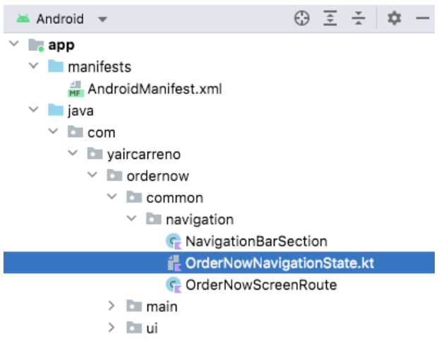


```OrderNowNavigationState```, являются расширениями общего состояния APP, то есть группой расширений состояния
состояния ```OrderNowState```, используемых для целей навигации. Мы также будем использовать эту структуру для централизации в ней
навигационной логики, которая зависит от состояния APP.

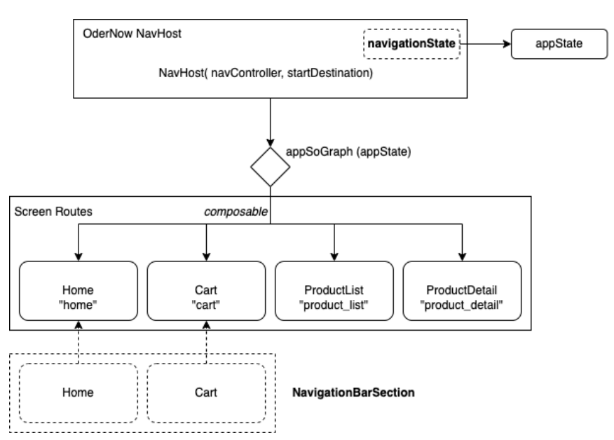

Реализация ```OrderNowNavigationState``` будет выглядеть следующим образом:

```kotlin
fun OrderNowState.popUp() {
2 navController.popBackStack()
3 }
4
5 fun OrderNowState.navigate(route: String) {
6 navController.navigate(route) {
7 launchSingleTop = true
8 }
9 }
10
11 fun OrderNowState.navigateAndPopUp(route: String, popUp: String) {
12 navController.navigate(route) {
13 launchSingleTop = true
14 popUpTo(popUp) { inclusive = true }
15 }
16 }
17
18 fun OrderNowState.navigateSaved(route: String, popUp: String) {
19 navController.navigate(route) {
20 launchSingleTop = true
21 restoreState = true
22 popUpTo(popUp) { saveState = true }
23 }
24 }
fun OrderNowState.clearAndNavigate(route: String) {
27 navController.navigate(route) {
28 launchSingleTop = true
29 popUpTo(0) { inclusive = true }
30 }
31 }

```

Несколько изменений вносятся в экраны Home, ProductList и ProductDetail, как показано на следующем рисунке

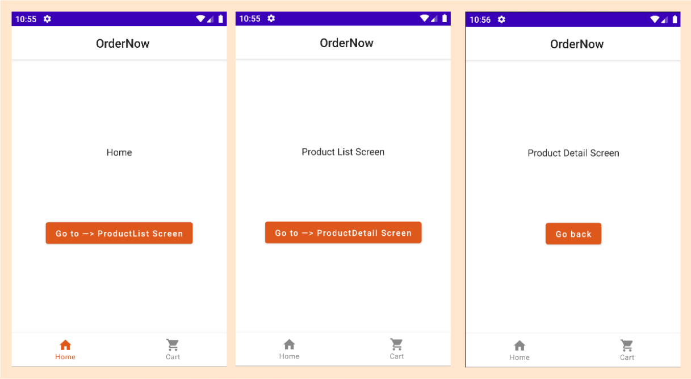

Например, в режиме «Дом» действие навигации выполняется с помощью кнопки следующим образом:

```kotlin
@Composable
2 fun HomeScreen(
3 goToProductList: () -> Unit,
4 modifier: Modifier = Modifier,
5 viewModel: HomeViewModel = hiltViewModel()
6 ) {
7 Column {
8 ...
9 Button(
10 onClick = goToProductList,
11 ...
12 ) {
    Text(text = stringResource(id = AppText.to_product_list_screen))
14 }
15 }
16 }
```

Важной частью фрагмента кода 6.10 является определение действия onClick = goToProductList кнопки
кнопки «Go to -> ProductList Screen», где с помощью техники поднятия состояния, описанной в главе «Принципы проектирования
Принципы проектирования, мы делегируем действие goToProductList навигационной карте appSoGraph, определенной в
OrderNowNavHost, следующим образом:

```kotlin
fun NavGraphBuilder.appSoGraph(appState: OrderNowState) {
2
3 val goToListFromHome: () -> Unit = {
4 appState.navigateSaved(OrderNowScreenRoute.ProductList.route,
5 OrderNowScreenRoute.Home.route)
6 }
7
8 // Home Screen Graph
9 composable(NavigationBarSection.Home.route) {
10 HomeScreen(goToProductList = goToListFromHome)
11 }
12
13 ...
14 }
```

Напомним, что функция navigateSaved является частью расширений, определенных в структуре под названием OrderNowNavigationState.
Аналогичная реализация применяется для навигации по другим экранам ProductList и ProductDetail таким образом.
что производительность в OrderNowNavHost следующая:

```kotlin
fun NavGraphBuilder.appSoGraph(appState: OrderNowState) {
2
3 val homeRoute = OrderNowScreenRoute.Home.route
4 val listRoute = OrderNowScreenRoute.ProductList.route
5 val detailRoute = OrderNowScreenRoute.ProductDetail.route
6
7 val goToListFromHome: () -> Unit = {
8 appState.navigateSaved(listRoute, homeRoute)
9 }
10
11 val goToDetailFromList: () -> Unit = {
12 appState.navigateSaved(detailRoute, listRoute)
13 }
val goBack: () -> Unit = {
16 appState.popUp()
17 }
18
19 composable(NavigationBarSection.Home.route) {
20 HomeScreen(goToProductList = goToListFromHome)
21 }
22
23 composable(NavigationBarSection.Cart.route) {
24 CartScreen()
25 }
26
27 composable(OrderNowScreenRoute.ProductList.route) {
28 ProductListScreen(goToProductDetail = goToDetailFromList)
29 }
30
31 composable(OrderNowScreenRoute.ProductDetail.route) {
32 ProductDetailScreen(goToBack = goBack)
33 }
34 }

```

В общем, это будут навигационные определения (навигационная карта), настроенные в предыдущем коде
фрагмент кода 6.12:
- Переход с главного экрана на экран ProductList.
- Переход от экрана ProductList к экрану ProductDetail.
- Переход с экрана ProductDetail на ранее представленный экран.
- Переход из меню BottomBar на главный экран.
- Перейдите из меню BottomBar на экран Cart.


На данный момент у нас уже есть отличная базовая реализация навигации в приложении OrderNow. Однако,
чего-то не хватает.
Есть идеи, чего может не хватать?
Мы должны включить в навигацию передачу данных или информации между экранами.
Это будет очень легко сделать благодаря реализации, которую мы разработали в этой главе, и мы
как это сделать в главе 7: Реализация «возможностей».


# Резюме
В этой главе мы завершили разработку основных частей приложения, которые станут
фундаментом для последующего добавления функциональных возможностей.
Мы знаем, что навигация - важнейшая часть приложения и что мы должны учитывать ее с самого начала
проектирования APP.
В этой главе мы использовали рекомендации Google по учету состояния при создании навигационной
логики.
Кроме того, читатель может оценить, что мы не вовлекаем ViewModel или View напрямую в нашу стратегию. Это
это делает ее гибкой для проверки навигации в целях тестирования.


# Chapter 7: Implementing “Features”

## Before starting

And finally, we have arrived at the part of implementing functionalities.
The first screen that we are going to implement will be the Home or main screen of the App, as shown in the
following figure 7.1:

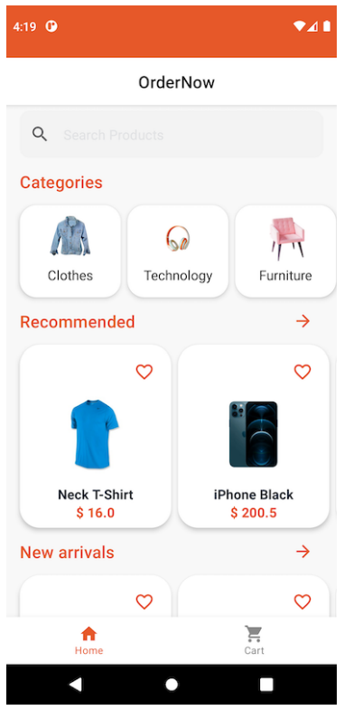

However, before we begin the implementation of the screen, we must ask ourselves the following questions:
• What information or data does the view require?

• How will the data be managed in the view?
• Where does the data used by the view come from?
The above reasoning is valid if we are designing declarative views on Android or iOS (yes, I know this is a
dedicated Android book, but we can’t ignore good practices that it can apply between one ecosystem and
another)³⁸

What information or data does the view require?
Categories and Products.
How will the data be managed in the view?
They will be presented as query information in list form and as horizontal carousels.
Where does the data used by the view come from?
It must come from a Source of truth, which in this example will be repositories in the Data layer.
The three questions above seem to be somewhat trivial; however, it tells us what is initially required for the
implementation:
• Two models, Category and Product.
• UI components of type lists are Composables of type LazyRow and LazyColumn.
• Two repositories to provide data on Category and Product.
According to the architecture guide that we analyzed in the Chapter 4: Application Architecture, we also
require:
• Add the Domain layer that will host the different Usecases. For this screen, we’ll use the structure
called ProductUseCases, which contains the granular use cases: GetCategoryList, GetProductDetail and
GetProductList.
• Include Ports to increase the decoupling of the Data layer. Two ports are identified, for now, one to
connect CategoryRepository and one to connect ProductRepository

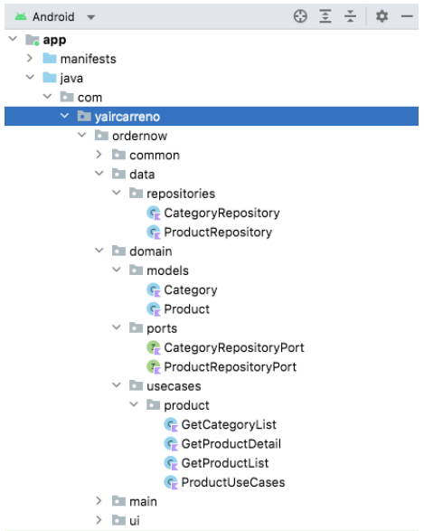


Implementations in Domain Layer
Models

```kotlin
data class Category(
2 val id: String,
3 val name: String,
4 val label: String,
5 val urlImage: String
6 )
7
8 data class Product(
9 val id: String,
10 val name: String,
11 val description: String? = null,
12 val urlImage: String,
13 val price: Double,
14 val category: Category
15 )
```

Repository Ports

```kotlin
interface CategoryRepository {
2 fun getCategories(): Flow<List<Category>>
3 }
4
5 interface ProductRepositoryPort {
6 fun getProducts(): Flow<List<Product>>
7 fun getProducts(category: Category): Flow<List<Product>>
8 }
```

UseCases

```kotlin
data class ProductUseCases(
2 val getProducts: GetProductList,
3 val getProduct: GetProductDetail,
4 val getCategories: GetCategoryList
5 )
6
7 class GetCategoryList(
8 private val repository: CategoryRepositoryPort
9 ) {
10
11 fun getCategories(): Flow<List<Category>> {
12 return repository.getCategories()
13 }
14 }
15
16 class GetProductList(
17 private val repository: ProductRepositoryPort
18 ) {
19
20 fun getProducts(): Flow<List<Product>> {
21 return repository.getProducts()
22 }
23
24 fun getProducts(category: Category): Flow<List<Product>> {
25 return repository.getProducts(category)
26 }
27 }
```

# Implementations in Data Layer
## Repositories

```kotlin
class CategoryRepository(
2 private val categoryDataSource: CategoryDataSource
3 ) : CategoryRepositoryPort {
4
5 override fun getCategories(): Flow<List<Category>> {
6 return categoryDataSource.getCategories()
7 }
8 }
9
10 class ProductRepository(
11 private val productDataSource: ProductDataSource
12 ) : ProductRepositoryPort {
13
14 override fun getProducts(): Flow<List<Product>> {
15 return productDataSource.getProducts()
16 }
17
18 override fun getProducts(category: Category): Flow<List<Product>> {
19 return productDataSource.getProducts(category)
20 }
21 }

```

# DataSources

```kotlin
interface CategoryDataSource {
2 fun getCategories(): Flow<List<Category>>
3 }
4
5 interface ProductDataSource {
6 fun getProducts(): Flow<List<Product>>
7 fun getProducts(category: Category): Flow<List<Product>>
8 }
```

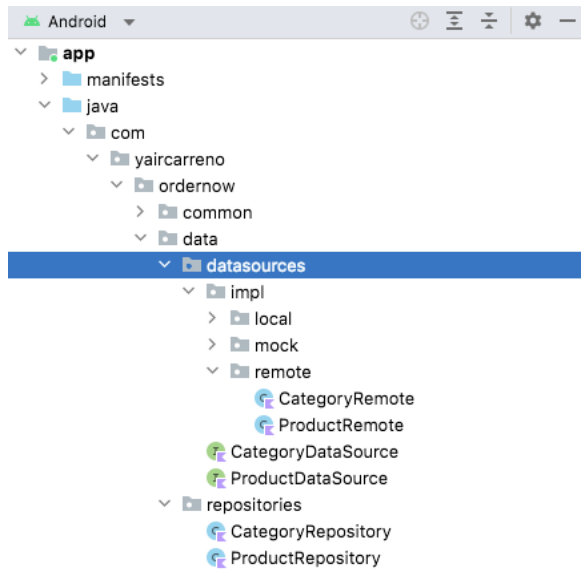


# Mocking DataSources and Previews
For the OrderNow implementation, we will use mocks to simulate the information query and the backend
payment process.
We will also make a simple mocks for the information presented in the Previews of each of the Composables
screens.
In the datasources -> impl -> mock directory, add the following implementations:

```kotlin
class DataMocked {
2
3 companion object Data {
4
5 // Categories data mocked
6 val category1 = Category(
7 "100",
8 "Clothes",
9 "Clothes",
10 "https://.../category_1.png"
11 )
12 ...
13 // Products data mocked
14 val product1 = Product(
15 "11",
16 "Neck T-Shirt",
"Price and other details may vary based on product size...",
18 "https://.../product_1.png",
19 16.0,
20 category1
21 )
22 ...
23 // CartItem data mocked
24 val cartItem1 = CartItem(
25 1,
26 product1
27 )
28 ...
29 }
30 }
class CategoryMocked : CategoryDataSource {
34
35 override fun getCategories(): Flow<List<Category>> {
36 val categories: List<Category> =
37 listOf(
38 DataMocked.category1,
39 DataMocked.category2,
40 ...
41 )
42 return flowOf(categories)
43 }
44 }
45
46 class ProductMocked : ProductDataSource {
47
48 val products: List<Product> =
49 listOf(
50 DataMocked.product1,
51 DataMocked.product2,
52 ...
53 )
54
55 override fun getProducts(): Flow<List<Product>> {
56 return flowOf(products)
57 }
58
59 override fun getProducts(category: Category): Flow<List<Product>> {
60 return flowOf(products.filter { it.category.id == category.id })
61 }
62 }
```

The following mock is defined in common -> previews directory. It will simulate the information in Previews.

```kotlin
class PreviewData {
2
3 companion object PreviewList {
4
5 val category = Category(
6 "1",
7 "Clothes",
8 "Clothes",
9 "category_1.png"
10 )
11 ...
12
13 val product = Product(
14 "1",
15 "Neck T-Shirt",
16 "Price and other details may vary based on product size...",
17 "product_1.png",
18 16.0,
19 category
20 )
21 ...
22
23 fun products(): List<Product> = listOf(product, ...)
24 fun categories(): List<Category> = listOf(category, ...)
25 fun cartProducts(): List<CartItem> = listOf(cart_product_1, ...)
26 }
27 }

```

# Graph of dependencies
Now that we have the main components in their respective layers in the added project, the next step is to
define the dependency map, for which Hilt will be used like this:

```kotlin
@Module
2 @InstallIn(SingletonComponent::class)
3 object AppModule {
4
5 @Provides
6 @Singleton
7 fun provideProductDataSource(): ProductDataSource {
8 return ProductMocked()
9 }
10
11 @Provides
12 @Singleton
13 fun provideCategoryDataSource(): CategoryDataSource {
14 return CategoryMocked()
15 }
16
17 @Provides
18 @Singleton
19 fun provideProductRepository(
20 productDataSource: ProductDataSource
21 ): ProductRepositoryPort {
22 return ProductRepository(productDataSource)
23 }
24
25 @Provides
26 @Singleton
27 fun provideCategoryRepository(
28 categoryDataSource: CategoryDataSource
29 ): CategoryRepositoryPort {
30 return CategoryRepository(categoryDataSource)
31 }
@Provides
34 @Singleton
35 fun provideProductUseCases(
36 productRepository: ProductRepositoryPort,
37 categoryRepository: CategoryRepositoryPort
38 ): ProductUseCases {
39 return ProductUseCases(
40 getProducts = GetProductList(productRepository),
41 getProduct = GetProductDetail(productRepository),
42 getCategories = GetCategoryList(categoryRepository)
43 )
44 }
45 }

```

We must update this dependency model each time we add new components to the application that need to
be made available through dependency injection.
Now, let’s make a change to the ViewModel to verify that our implementation works correctly:

```kotlin
@HiltViewModel
2 class HomeViewModel @Inject constructor(
3 private val productUseCases: ProductUseCases
4 ) : ViewModel() {
5
6 init {
7 viewModelScope.launch {
8 productUseCases.getProducts.getProducts().collect {
9 println(it)
10 }
11 }
12 }
13 }
```

In the console, if everything runs correctly, it should show in Logcat something similar to:

```kotlin
.ordernow I/System.out: [Product(id=11,
2 name=Neck T-Shirt,
3 description=Neck T-Shirt,
4 urlImage=https://.../product_1.png,
5 price=16.0), ...]
```

# Home Screen

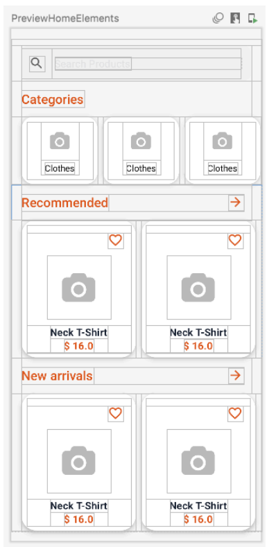

Now that the services and component configurations in Domain and Data layers are ready, we will proceed to the layout of the Home view.

What information or data does the view require?
The Sketch of this screen indicates that it is made up of the following elements:
• Search Section.
• Carousel with category list.
• Carousel with recommended product list.
• Carousel with new products list.

We organize the Home screen into sections through Slot APIs like this:

```kotlin
@Composable
2 private fun HomeElements(
3 categories: List<Category>,
4 products: List<Product>,
5 categorySelected: (category: Category) -> Unit,
6 productSelected: (product: Product) -> Unit,
7 modifier: Modifier = Modifier,
8 ) {
9 Column(
10 modifier
11 .verticalScroll(rememberScrollState())
12 .padding(vertical = 16.dp)
13 ) {
14 SearchBar(Modifier.padding(horizontal = 16.dp))
15 HomeSection(
16 title = stringResource(AppText.categories),
17 withArrow = false
18 ) {
19 CategorySection(
20 categories = categories,
21 categorySelected = categorySelected
22 )
23 }
24 HomeSection(
25 title = stringResource(AppText.recommended),
26 withArrow = true
27 ) {
28 ProductSection(
29 products = products,
30 productSelected = productSelected
31 )
32 }
33 HomeSection(
34 title = stringResource(AppText.new_arrivals),
35 withArrow = true
36 ) {
37 ProductSection(
38 products = products,
39 productSelected = productSelected
40 )
41 }
42 }
43 }
@Composable
2 fun HomeSection(
3 title: String,
4 withArrow: Boolean,
5 modifier: Modifier = Modifier,
6 content: @Composable () -> Unit
7 ) {
8 Column(modifier) {
9 Row(
10 verticalAlignment = Alignment.CenterVertically,
11 modifier = Modifier
12 .heightIn(min = 56.dp)
13 .padding(horizontal = 16.dp)
14 ) {
15 Text(
16 text = title,
17 style = MaterialTheme.typography.h6,
18 color = orange,
19 maxLines = 1,
20 overflow = TextOverflow.Ellipsis,
21 modifier = Modifier
22 .weight(1f)
23 .wrapContentWidth(Alignment.Start)
24 )
25 if (withArrow) {
26 IconButton(
27 onClick = { },
28 modifier = Modifier.align(Alignment.CenterVertically)
29 ) {
30 Icon(
31 imageVector = mirroringIcon(
32 ltrIcon = Icons.Outlined.ArrowForward,
33 rtlIcon = Icons.Outlined.ArrowBack
34 ),
35 tint = orange,
36 contentDescription = null
37 )
38 }
39 }
40 }
41 content()
42 }
43 }

```

From the above code snippet 7.12, it should highlight the use of the property:

• verticalScroll(rememberScrollState())
Using this property in the column helps organize the sections more efficiently.
Another alternative implementation of the sections would have been using a LazyColumn component;
however, for short content, it is better to use the verticalScroll() as Google tells us in Basic layouts in
Compose⁴¹.


```kotlin
@Composable
2 private fun HomeElements(
3 categories: List<Category>,
4 ...
5 ) {
6 Column(
7 modifier
8 .verticalScroll(rememberScrollState())
9 .padding(vertical = 16.dp)
10 ) {
11 ...
12 }
13 }

```

The use of Slot APIs helps the reuse of views and their dynamic composition:

```kotlin
@Composable
2 fun HomeSection(
3 ...
4 content: @Composable () -> Unit
5 ) {
6 Column(modifier) {
7 Row(
8 verticalAlignment = Alignment.CenterVertically,
9 ...
10 ) {
11 ...
12 }
13 content()
14 }
15 }
```

Through the Slot APIs, this technique is also clearly explained in Basic layouts in Compose⁴².

# Where does the data used by the view come from?

Data is provided by Usecase, which obtains it from the respective Repository.
A repository is the only reliable source that delivers the data; that is, it is the source of truth.
Usecase delivers the information to the ViewModel through a data flow defined with Flow Coroutines and
transformed into states through StateFlow.
The view receives from the ViewModel the flow’s state of said information and reacts according to its values.
The definitions of HomeViewModel and HomeScreen are as follows:

```kotlin
@HiltViewModel
2 class HomeViewModel @Inject constructor(
3 private val productUseCases: ProductUseCases
4 ) : ViewModel() {
5
6 val productListState = productUseCases.getProducts.getProducts()
7 .stateIn(viewModelScope, SharingStarted.Eagerly, emptyList())
8
9 val categoryListState = productUseCases.getCategories.getCategories()
10 .stateIn(viewModelScope, SharingStarted.Eagerly, emptyList())
11 }
12
13 @Composable
14 fun HomeScreen(
15 categorySelected: (category: Category) -> Unit,
16 productSelected: (product: Product) -> Unit,
17 modifier: Modifier = Modifier,
18 viewModel: HomeViewModel = hiltViewModel()
19 ) {
20
21 val products by viewModel.productListState.collectAsState()
22 val categories by viewModel.categoryListState.collectAsState()
23
24 HomeElements(
25 categories,
26 products,
27 categorySelected,
28 productSelected,
29 modifier = modifier.background(lightGrayBackground)
30 )
31 }
```

# Adding “Home” to the navigation
As discussed in Chapter 6: Designing navigation in App, the configuration of application navigation can be
supported with the OrderNowState. We will use this component to transport the data between the different
views like so:

```kotlin
class OrderNowState(
2 val scaffoldState: ScaffoldState,
3 val navController: NavHostController,
4 private val resources: Resources,
5 coroutineScope: CoroutineScope
6 ){
7 ...
8 lateinit var categorySelected: Category
9 lateinit var productSelected: Product
10 ...
11 }
```
Additionally, the navigation logic associated with this screen is added to the OrderNowNavHost component
like so:

```kotlin
fun NavGraphBuilder.appSoGraph(appState: OrderNowState) {
2
3 val homeRoute = OrderNowScreenRoute.Home.route
4 val listRoute = OrderNowScreenRoute.ProductList.route
5 val detailRoute = OrderNowScreenRoute.ProductDetail.route
6
7 val productSelectedInHome: (Product) -> Unit = { product: Product ->
8 appState.productSelected = product
9 appState.navigateSaved(detailRoute, homeRoute)
10 }
11 val categorySelectedInHome: (Category) -> Unit = { category: Category ->
12 appState.categorySelected = category
13 appState.navigateSaved(listRoute, homeRoute)
14 }
15
16 // Home Screen Graph
17 composable(NavigationBarSection.Home.route) {
18 HomeScreen(
19 categorySelected = categorySelectedInHome,
20 productSelected = productSelectedInHome
21 )
22 }
23 }
```

# Other settings
Finally, for the implementation of the Home, the following configurations are required in the application:
Installing Coil⁴³ for local or remote image loading and management required by the application:

```kotlin
implementation "io.coil-kt:coil-compose:2.0.0"
```

And add the internet permissions in the manifest to allow calling remote resources or services:

```xml
<uses-permission android:name="android.permission.INTERNET" />
```

An example of using Coil to fetch and render images might look like this:

```kotlin
@Composable
2 fun CategoryCard(
3 category: Category,
4 categorySelected: (category: Category) -> Unit
5 ) {
6 Card(
7 modifier = Modifier
8 ...
9 ) {
10 Column(
11 ...
12 verticalArrangement = Arrangement.Center
13 ) {
14 AsyncImage(
15 model = ImageRequest.Builder(LocalContext.current)
16 .data(category.urlImage)
17 .crossfade(true)
18 .build(),
19 placeholder = painterResource(R.drawable.placeholder),
20 contentDescription = "",
21 modifier = Modifier.size(60.dp),
22 )
23 }
24 }
25 }
```

# Product List Screen

Для реализации этого экрана создаются компоненты ProductItem и ProductItemList:

```kotlin
@Composable
2 fun ProductItemList(
3 products: List<Product>,
4 productSelected: (Product) -> Unit,
5 modifier: Modifier = Modifier,
6 ) {
7 LazyColumn(modifier = modifier) {
8 items(products, key = { it.id }) { product ->
9 ProductItem(product, productSelected)
10 }
11 }
12 }

@Composable
2 fun ProductItem(
3 product: Product,
4 productSelected: (Product) -> Unit
5 ) {
6 Row(
7 ...
8 ) {
9 Box(
10 ...
11 ) {
12 AsyncImage(
13 model = ...
14 )
15 }
16 Column(
17 modifier = Modifier
18 .fillMaxWidth(0.8f)
19 ) {
20
21 Text(
22 text = product.name,
23 fontWeight = FontWeight.Bold,
24 fontSize = 16.sp,
25 color = titleTextColor
26 )
27 Spacer(modifier = Modifier.height(10.dp))
28 Text(
29 text = buildAnnotatedString {
30 withStyle(
31 style = SpanStyle(
32 orange,
33 fontWeight = FontWeight.Bold
34 )
35 ) {
36 append("$ " + product.price)
37 }
38 },
39 style = MaterialTheme.typography.subtitle1,
40 modifier = Modifier,
41 fontSize = 16.sp
42 )
43 }
44 Box(
45 modifier = Modifier
.padding(top = 20.dp, end = 20.dp)
47 .align(Alignment.Top)
48 ) {
49 Icon(
50 imageVector = Icons.Outlined.FavoriteBorder,
51 contentDescription = "",
52 tint = orange
53 )
54 }
55 }
56 }
```

Затем обновляется модель ProductListViewModel:

```kotlin
@HiltViewModel
2 class ProductListViewModel @Inject constructor(
3 private val productUseCases: ProductUseCases
4 ) : ViewModel() {
5
6 val productListState = { category: Category ->
7 productUseCases.getProducts.getProducts(category)
8 .stateIn(viewModelScope, SharingStarted.Eagerly, emptyList())
9 }
10 }
```

In the above code snippet 7.23, we should highlight the use of StateFlow to represent the product list’s state.
That is an example of state representation studied in the section of the first chapter, Property UI’s state.
In this view, the definitions are as follows:

```kotlin
@Composable
2 fun ProductListScreen(
3 category: Category,
4 productSelected: (Product) -> Unit,
5 modifier: Modifier = Modifier,
6 viewModel: ProductListViewModel = hiltViewModel()
7 ) {
8 val products by viewModel.productListState(category).collectAsState()
9
10 ProductListContent(
11 products,
12 productSelected,
13 modifier = modifier.background(lightGrayBackground)

)
15 }
16
17 @Composable
18 fun ProductListContent(
19 products: List<Product>,
20 productSelected: (Product) -> Unit,
21 modifier: Modifier = Modifier
22 ) {
23 ProductItemList(
24 products = products,
25 productSelected = productSelected,
26 modifier = modifier
27 )
28 }
```

# Adding “ProductList” to the navigation

Finally, the screen is added to the navigation graph like so:

```kotlin
fun NavGraphBuilder.appSoGraph(appState: OrderNowState) {
2
3 ...
4 val listRoute = OrderNowScreenRoute.ProductList.route
5 val detailRoute = OrderNowScreenRoute.ProductDetail.route
6 ...
7
8 val productSelectedInList: (Product) -> Unit = { product: Product ->
9 appState.productSelected = product
10 appState.navigateSaved(detailRoute, listRoute)
11 }
12
13 ...
14
15 // Product List Screen Graph
16 composable(OrderNowScreenRoute.ProductList.route) {
17 ProductListScreen(
18 category = appState.categorySelected,
19 productSelected = productSelectedInList
20 )
21 }
22 ...
23 }
```

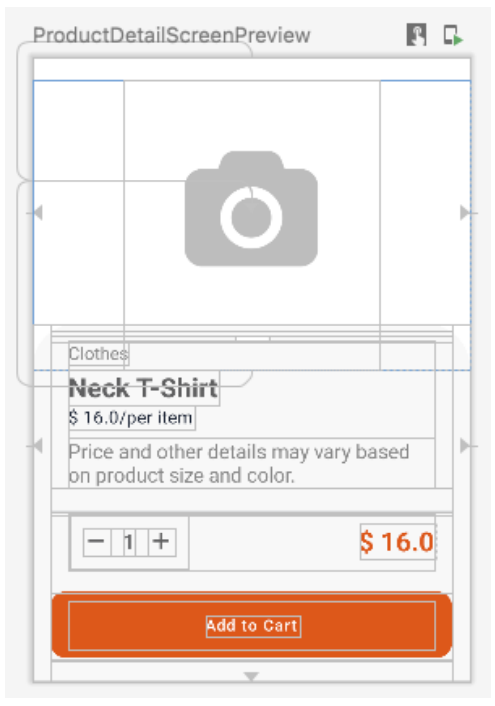

For the product detail screen implementation, it is first required to add the following dependency to use the
Constraintlayout components in Jetpack Compose:

```kotlin
implementation "androidxconstraintlayout:constraintlayout-compose:1.0.1"
```

ProductDetailScreen view is added:

```kotlin
1 @Composable
2 fun ProductDetailScreen(
3 product: Product,
4 goToCart: () -> Unit,
5 modifier: Modifier = Modifier,
6 viewModel: ProductDetailViewModel = hiltViewModel(),
7 ) {
8 BodyDetail(
9 product = product,
10 addToCart = { count -> viewModel.saveItemCart(product, count) },
11 showAlert = viewModel.showAlert,
12 onGoToCart = goToCart,
13 onPopupDismissed = viewModel.onPopupDismissed(),
14 modifier = modifier
15 .fillMaxSize()
16 .background(lightGrayBackground)
17 )
18 }
```

And its corresponding ProductDetailViewModel:

```kotlin
@HiltViewModel
2 class ProductDetailViewModel @Inject constructor(
3 private val cartUseCases: CartUseCases
4 ) : ViewModel() {
5
6 var showAlert by mutableStateOf(false)
7 private set
8
9 fun saveItemCart(product: Product, quantity: Int) {
10 viewModelScope.launch {
11 val cartItem = CartItem(
12 quantity = quantity,
13 product = product
14 )
15 cartUseCases.saveItemCart
16 .saveItem(cartItem).collect {
17 showAlert = true
18 }
19 }
20 }
21
22 fun onPopupDismissed(): () -> Unit = {
    showAlert = false
24 }
25 }
```


# Adding “Back” to the TopAppBar
To allow the Go Back option to be visible in the TopAppBar, the state of the application is used again to
configure those screens that require going back in the navigation, like this:
In OrderNowScreenRoute:

```kotlin
sealed class OrderNowScreenRoute (val route: String) {
2
3 companion object {
4 val withArrowBack = listOf(
5 ProductDetail,
6 Checkout,
7 PlaceOrder
8 )
9 }
10
11 object Home : OrderNowScreenRoute("home")
12 object Cart : OrderNowScreenRoute("cart")
13 object ProductList : OrderNowScreenRoute("product_list")
14 object ProductDetail : OrderNowScreenRoute("product_detail")
15 ...
16 }

```

The withArrowBack property will define which screens require the Go Back option to be presented.
In OrderNowState

```kotlin
class OrderNowState(
2 val scaffoldState: ScaffoldState,
3 ...
4 ){
5 private val screensWithArrowBack = OrderNowScreenRoute.withArrowBack.map { it.route }
6
7 val shouldShowArrowBack: Boolean
8 @Composable get() = navController
9 .currentBackStackEntryAsState()
10 .value?.destination?.route in screensWithArrowBack

...
13 }
```

The shouldShowArrowBack property will tell the view whether or not to display the option in TopAppBar
like so:

```kotlin
@Composable
2 fun OrderNowTopBar(appState: OrderNowState) {
3 if (appState.shouldShowArrowBack) {
4 TopAppBarWithArrow(
5 title = stringResource(id = R.string.app_name),
6 goBack = appState.popUp()
7 )
8 } else {
9 TopAppBarWithoutArrow(
10 title = stringResource(id = R.string.app_name)
11 )
12 }
13 }
```

# Cart Screen

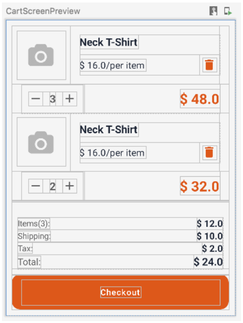


The Sketch of this screen indicates that it is made up of the following elements:
• The list of items added to the cart will be represented as a Component UI’s state called cartState.
• The purchase summary will also be represented as a Component UI’s state called orderSummaryState.
• The checkout process button will be a component whose state will depend on the two previous states,
cartState and orderSummaryState.
In this design, I have chosen to define cartState and orderSummaryState as independent of each other;
however, it could also be valid for orderSummaryState to depend on cartState.
The implementation of CartViewModel would be as follows:

```kotlin
@HiltViewModel
2 class CartViewModel @Inject constructor(
3 private val cartUseCases: CartUseCases,
4 ) : ViewModel() {
5
6 var cartState by mutableStateOf(CartState())
7 private set
8
9 var orderSummaryState by mutableStateOf(OrderSummaryState())
10 private set

init {
13 viewModelScope.launch {
14 cartUseCases.getCartItems
15 .getCartItems().collect {
16 updateStates(cartItems = it)
17 }
18 }
19 }
20
21 ...
22
23 private fun updateStates(cartItems: List<CartItem>) {
24 cartState = cartState.copy(cartItems = cartItems)
25 orderSummaryState = orderSummaryState.copy(cartItems = cartItems)
26 }
27 ...
28 }

```

And the definition of the Component UI’s state CartState and OrderSummaryState like so:

```kotlin
data class CartState(
2 val cartItems: List<CartItem> = emptyList()
3 )
4
5 val CartState.readyForCheckout: Boolean
6 get() = cartItems.isNotEmpty()
```


```kotlin
data class OrderSummaryState(
2 val cartItems: List<CartItem> = emptyList(),
3 val shipping: Double = 0.00,
4 val tax: Double = 0.00
5 )
6
7 val OrderSummaryState.itemsTotal: Double
8 get() =
9 cartItems
10 .map { item -> item.product.price * item.quantity }
11 .fold(0.0) { total, next -> total + next }
12
13 val OrderSummaryState.allTotal: Double
14 get() = itemsTotal + shipping + tax
```
From the view side, the implementation could be like this:

```kotlin
@Composable
2 fun CartScreen(
3 goToCheckout: (SummaryTotals) -> Unit,
4 modifier: Modifier = Modifier,
5 viewModel: CartViewModel = hiltViewModel(),
6 ) {
7 CartUI(
8 cartState = viewModel.cartState,
9 orderSummaryState = viewModel.orderSummaryState,
10 ...
11 checkoutSelected = { goToCheckout(viewModel.getSummaryOrder()) },
12 ...
13 )
14 }
15
16 @Composable
17 fun CartUI(
18 cartState: CartState,
19 orderSummaryState: OrderSummaryState,
20 ...
21 checkoutSelected: () -> Unit,
22 ...
23 ) {
24 if (cartState.cartItems.isEmpty()) {
25 Empty("No cart items found")
26 } else {
27 CartElements(
28 cartItems = cartState.cartItems,
29 numberItems = cartState.cartItems.size,
30 totalItems = orderSummaryState.itemsTotal,
31 ...
32 )
33 }
34 }
```

In the previous code snippet 7.35, we have used the recommended naming in the Naming composable
functions section for better clarity of each element.
Another point to highlight in the implementation is the reuse given to the Composable called Quantity:

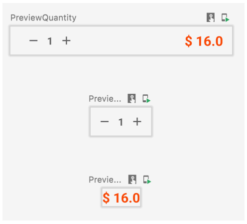

```kotlin
@Composable
2 fun Quantity(
3 count: Int,
4 decreaseItemCount: () -> Unit,
5 increaseItemCount: () -> Unit,
6 price: Double
7 ) {
8
9 Row(
10 modifier = Modifier
11 .fillMaxWidth()
12 .padding(horizontal = 16.dp),
13 horizontalArrangement = Arrangement.SpaceBetween,
14 verticalAlignment = Alignment.CenterVertically
15 ) {
16
17 QuantitySelector(
18 count = count,
19 decreaseItemCount = decreaseItemCount,
20 increaseItemCount = increaseItemCount
21 )
22
23 PriceView(price)
24 }
25 }

```

We are using this Quantity view both in the detail screen and in the shopping cart screen, and it shows us
the capacity that Jetpack Compose provides us to atomize components in the UI.
That is also possible because we have defined the Quantity view as a stateless view using the state hoisting
technique, both described in Chapter 1: Design principles.

Another point to highlight in the implementation is the following:

```kotlin
@Composable
2 fun CartElements(
3 cartItems: List<CartItem>,
4 ...
5 ) {
6 LazyColumn(
7 modifier = modifier,
8 contentPadding = contentPadding
9 ) {
10 items(cartItems, key = { it.product.id }) { cartItem ->
11 CartViewItem(...)
12 }
13 item {
14 CartSummary(...)
15 CartBottom(...)
16 }
17 }
18 }
```

Unlike the example implementation of the Home Screen, we are not using the property:
• verticalScroll(…)
Do you know the reason?
In this case, it is not convenient to use this property since its use would generate nesting of scrolls in the same
direction. That is caused because the cartItems list is represented by a LazyColumn, which implicitly includes
a vertical scroll.
I recommend this excellent documentation from Google, where they give us more detail, and other good
practices Avoid nesting components scrollable in the same direction⁴⁷

# Checkout Screen

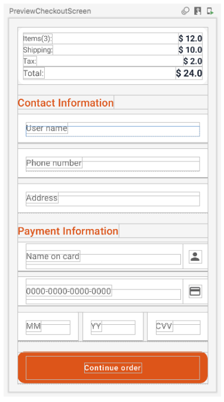

To implement this screen, we will use the concepts learned in Chapter 2: Codelab - Practicing with states.
In that chapter, we saw how to organize a screen’s elements by grouping states and events to have a better
clean code.
The Sketch of this screen indicates that it is made up of the following elements:
• Section with the summary of the purchase values, which the CartScreen previous view will deliver
through navigation.
• The contact information component will be represented as a Component UI’s state called ContactFormState.
• The payment information component will be represented as a Component UI’s state called PaymentFormState.
• Button to continue with the purchase process, a component that will depend on the ContactFormState
and PaymentFormState states.
The implementation of CheckoutViewModel would be as follows:

```kotlin
@HiltViewModel
2 class CheckoutViewModel @Inject constructor() : ViewModel() {
3
4 var contactUiState by mutableStateOf(ContactFormState())
5 private set
6
7 var paymentUiState by mutableStateOf(PaymentFormState())
8 private set
9
10 val onContactFormEvent: (ContactFormEvent) -> Unit = { event ->
11 contactUiState = when (event) {
12 is ContactFormEvent.OnNameChange -> {
13 contactUiState.copy(username = event.name)
14 }
15 is ContactFormEvent.OnPhoneChange -> {
16 contactUiState.copy(phone = event.phone)
17 }
18 is ContactFormEvent.OnAddressChange -> {
19 contactUiState.copy(address = event.address)
20 }
21 }
22 }
23
24 val onPaymentFormEvent: (PaymentFormEvent) -> Unit = { event ->
25 paymentUiState = when (event) {
26 is PaymentFormEvent.OnNameChange -> {
27 paymentUiState.copy(name = event.name)
28 }
29 is PaymentFormEvent.OnNumberChange -> {
30 paymentUiState.copy(number = event.number)
31 }
32 is PaymentFormEvent.OnMonthChange -> {
33 paymentUiState.copy(month = event.month)
34 }
35 is PaymentFormEvent.OnYearChange -> {
36 paymentUiState.copy(year = event.year)
37 }
38 is PaymentFormEvent.OnCodeChange -> {
39 paymentUiState.copy(code = event.code)
40 }
41 }
42 }
43 ...
44 }
```

And the definition of the Component UI’s state ContactFormState and PaymentFormState is like this:

```kotlin
data class ContactFormState(
2 val username: String = "",
3 val phone: String = "",
4 val address: String = "",
5 )
6
7 val ContactFormState.successValidated: Boolean
8 get() = username.length > 1
9 && phone.length > 1
10 && address.length > 1
```

```kotlin
data class PaymentFormState(
2 val name: String = "",
3 val number: String = "",
4 val month: String = "",
5 val year: String = "",
6 val code: String = ""
7 )
8
9 val PaymentFormState.successValidated: Boolean
10 get() = name.length > 1
11 && number.length > 1
12 && month.length > 1
13 && year.length > 1
14 && code.length > 2
```

Чтобы уменьшить количество параметров в композитных функциях в представлении, мы определим вспомогательную
структуру, которую назовем ```StateVsEvent``` следующим образом:


```kotlin
data class StateVsEvent(
2 val value: String = "",
3 val onValueChange: (String) -> Unit = {}
4 )

```

This structure will group as a pair, both the value (state) and the action (event), for instance, like this:

```kotlin
PaymentInformation(
2 nameStateVsEvent = StateVsEvent(
3 value = payment.name,
4 onValueChange = {
5 onPaymentEvent(PaymentFormEvent.OnNameChange(it))
6 }),
7 ...
8 )
```

Why use Data class instead of Pair?
It is a documented recommendation in “Prefer data classes instead of tuples”⁴⁹.
From the view side, and using the recommended nomenclature in the Naming composable functions section,
the implementation could look like this:


```kotlin
@Composable
2 fun CheckoutScreen(
3 summary: SummaryTotals,
4 goToPlaceOrder: (Order) -> Unit,
5 modifier: Modifier = Modifier,
6 viewModel: CheckoutViewModel = hiltViewModel()
7 ) {
8 CheckoutUI(
9 summary = summary,
10 ...
11 )
12 }
```

```kotlin
@Composable
2 fun CheckoutUI(
3 summary: SummaryTotals,
4 contactUiState: ContactFormState,
5 onContactEvent: (ContactFormEvent) -> Unit,
6 paymentUiState: PaymentFormState,
7 onPaymentEvent: (PaymentFormEvent) -> Unit,
8 onContinueOrder: () -> Unit,
9 modifier: Modifier = Modifier,
10 ) {
CheckoutElements(
12 summary = summary,
13 ...
14 )
15 }
```

```kotlin
@Composable
2 fun CheckoutElements(
3 summary: SummaryTotals,
4 contact: ContactFormState,
5 onContactEvent: (ContactFormEvent) -> Unit,
6 payment: PaymentFormState,
7 onPaymentEvent: (PaymentFormEvent) -> Unit,
8 onContinueOrder: () -> Unit,
9 modifier: Modifier = Modifier,
10 ) {
11 Column(
12 ...
13 ) {
14 SummaryCard(
15 numberItems = summary.numberItems,
16 totalItems = summary.totalItems,
17 ...
18 )
19 CheckoutSection(
20 title = "Contact Information"
21 ) {
22 ContactInformation(
23 nameStateVsEvent = StateVsEvent(
24 value = contact.username,
25 onValueChange = {
26 onContactEvent(ContactFormEvent.OnNameChange(it))
27 }),
28 ...
29 )
30 }
31 CheckoutSection(
32 title = "Payment Information"
33 ) {
34 PaymentInformation(
35 nameStateVsEvent = StateVsEvent(
36 value = payment.name,
37 onValueChange = {
38 onPaymentEvent(PaymentFormEvent.OnNameChange(it))
}),
40 ...
41 )
42 }
43 StandardButton(
44 text = stringResource(R.string.continue_order),
45 onClicked = onContinueOrder,
46 enabled = contact.successValidated
47 && payment.successValidated
48 )
49 }
50 }
```

Before I finish, I need to highlight the following piece of code:

```kotlin
@Composable
2 fun CheckoutScreen(
3 ...
4 goToPlaceOrder: (Order) -> Unit,
5 ...
6 ) {
7 CheckoutUI(
8 ...
9 onContinueOrder = { goToPlaceOrder(viewModel.getOrder(summary)) },
10 ...
11 )
12 }

```

That is a pattern to send an event to ViewModel from View before handing control over to the state for further
navigation.


# Place Order Screen

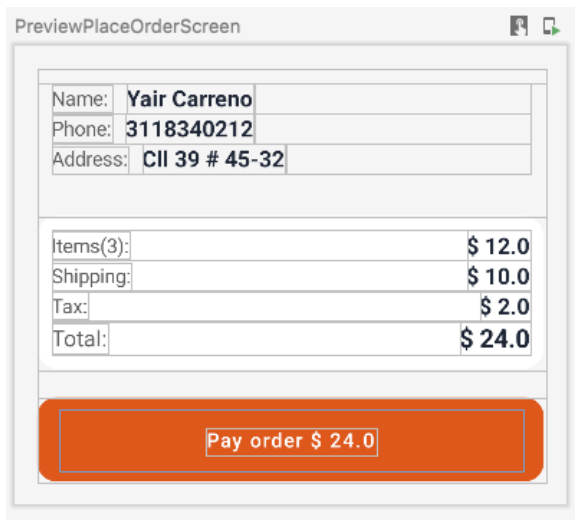


Finally, the last screen to be described is the one corresponding to the order payment process.
A mock operation has been created to simulate the payment process using Coroutines and a delay of 4 seconds
like this:

```kotlin
class PaymentMocked : PaymentDataSource {
2
3 override suspend fun doPayment(order: Order): PaymentResult {
4 return withContext(Dispatchers.IO) {
5 delay(4000)
6 PaymentResult(
7 status = true,
8 payment = Payment(
9 status = "SUCCESS",
10 reference = "123ABC")
11 )
12 }
13 }
14 }
```

The most important part to highlight in the implementation of this screen is how the payment flow is defined
with the following characteristics:
• The payment operation is modeled as a state through mutableStateOf. In this case, it has been named
PaymentState.

The view only relies on the PaymentState state for UI decision-making. That is an excellent recommendation by Manuel Vivo from Google in the article ViewModel: One-off event antipatterns⁵¹.
• Depending on the result of the payment operation (status), the view (Composable) will make a dynamic
recomposition of the elements presented on the screen. It’s an excellent example to demonstrate the
flexibility and power of Jetpack Compose again on Android.
The definition of the state would be as follows:

```kotlin
data class PaymentState(
2 val paymentInformation: Payment = Payment(),
3 val isLoading: Boolean = false,
4 val paymentResult: PaymentResult? = null,
5 val errorMessage: String? = null
6 )
```

In PlaceOrderViewModel, the operations that will depend on the state are defined as follows:

```kotlin
@HiltViewModel
2 class PlaceOrderViewModel @Inject constructor(
3 private val paymentUseCases: PaymentUseCases,
4 ) : ViewModel() {
5
6 var paymentUiState by mutableStateOf(PaymentState())
7 private set
8
9 fun makePayment() {
10 viewModelScope.launch {
11 paymentUiState = paymentUiState.copy(isLoading = true)
12 try {
13 val paymentResult = paymentUseCases.doPayment
14 .doPayment(order = PreviewData.order)
15 paymentUiState =
16 paymentUiState.copy(
17 isLoading = false,
18 paymentResult = paymentResult
19 )
20 } catch (ioe: IOException) {
21 paymentUiState = paymentUiState.copy(
22 isLoading = false,
23 errorMessage = "Error with the transaction"
24 )
25 }
}
27 }
28 }
```

And in this view side, the implementation is as follows:

```kotlin
@Composable
2 fun PlaceOrderScreen(
3 order: Order,
4 modifier: Modifier = Modifier,
5 viewModel: PlaceOrderViewModel = hiltViewModel(),
6 ) {
7 OrderUI(
8 order = order,
9 paymentUiState = viewModel.paymentUiState,
10 onPlaceOrder = { viewModel.makePayment() },
11 modifier = modifier
12 .fillMaxSize()
13 .background(lightGrayBackground)
14 )
15 }
16
17 @Composable
18 fun OrderUI(
19 order: Order,
20 paymentUiState: PaymentState,
21 onPlaceOrder: () -> Unit,
22 modifier: Modifier,
23 ) {
24 if (paymentUiState.isLoading) {
25 Loading()
26 } else {
27 Column {
28 if (paymentUiState.paymentResult != null) {
29 val successful = paymentUiState.paymentResult.status
30 if (successful) {
31 Results(userMessage = "Thanks for your purchase.") {
32 OrderSummary(
33 order = order
34 )
35 }
36 }
37 } else {
38 OrderElements(
39 order = order,
onPlaceOrder = onPlaceOrder,
41 modifier = modifier
42 )
43 }
44 }
45 }
46 }
```

From code snippet 7.50 above, the part to highlight is the following:

```kotlin
@Composable
2 fun OrderUI(
3 ...
4 paymentUiState: PaymentState,
5 ...
6 ) {
7 if (paymentUiState.isLoading) {
8 ...
9 } else {
10 Column {
11 if (paymentUiState.paymentResult != null) {
12 val successful = ...
13 if (successful) {
14 Results(userMessage = "Thanks for your purchase.") {
15 OrderSummary(...)
16 }
17 }
18 } else {
19 OrderElements(...)
20 }
21 }
22 }
23 }

```

The order summary view is atomized and can be presented differently depending on the state.


# Summary
Wow! I think this has been the book’s longest chapter, but it is not for less. Here we have put together all the
critical tabs of our OrderNow app.
Based on the basic concepts of the first chapters, we have finally experienced the relevant capabilities and
techniques when implementing the solution.
We refined the navigation process using the state of the App as a reference. We also involved sending
information through navigation in a flexible way.
We organize our code using Clean Architecture recommendations and applying Clean Code pragmatically,
using a nomenclature that can be clear to any developer reviewing the sources.
We review how from the Sketch of a screen, we visualize the main components, their states, their events, and
the relationships between them.
We reuse views across multiple screens to show the flexibility of Compose.
Through Coroutines and Flow, we also managed to generate the information flows required by the views and
worked through the states with the support of ViewModels.
And this is the final chapter of the book. I hope this work has been helpful for the reader and serves as a
reference for his projects.
Total thanks.