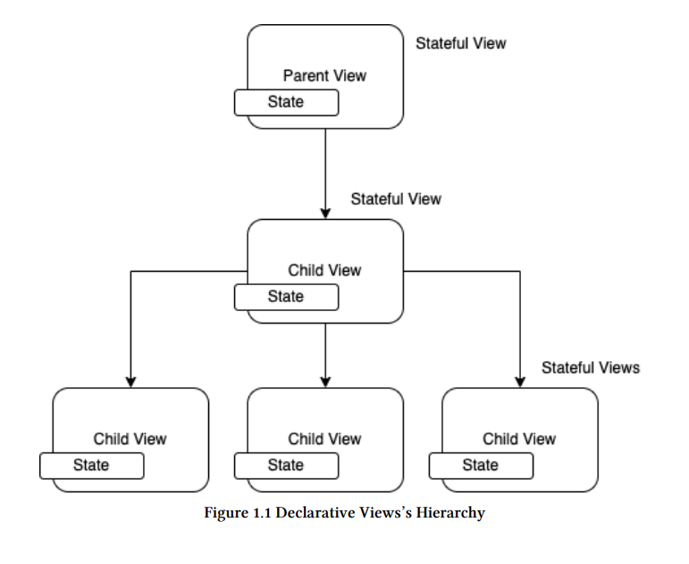
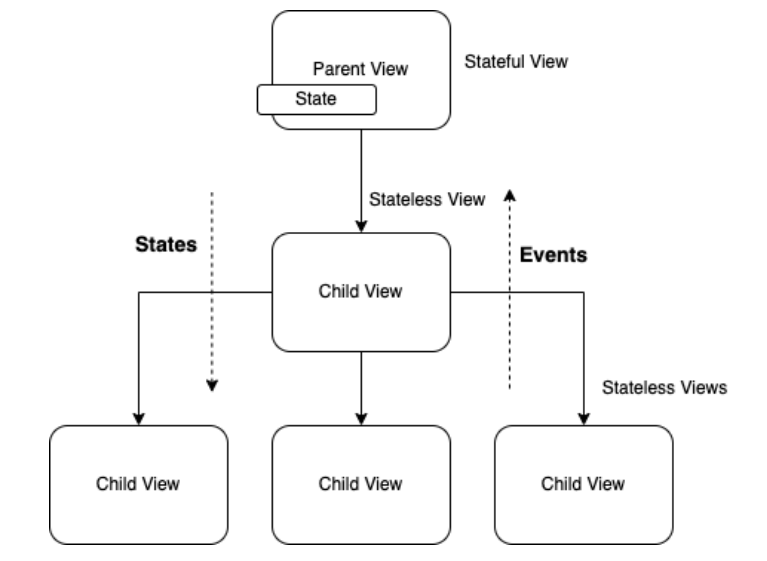
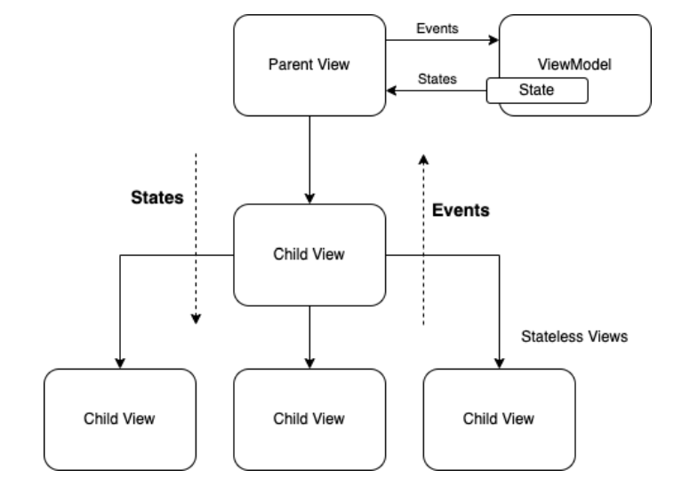

# Глава 1: Принципы проектирования

«Состояние» - сердце декларативных представлений

Первая парадигма, которую мы должны четко представлять при разработке декларативных представлений с помощью таких фреймворков, как ```Compose```
или ```SwiftUI```, является состояние.

Компонент пользовательского интерфейса объединяет в себе графическое представление (View) и состояние.

Любое свойство или данные, которые изменяются в компоненте пользовательского интерфейса, могут быть представлены в виде состояния.
Например, в UI-компоненте типа ```TextFiel``` текст, введенный пользователем, является переменной, которая может изменяться;
Поэтому value - это переменная, которая может быть представлена как состояние (имя), как показано в следующем коде
фрагмент 1.1.

```kotlin
TextField(
    label = { Text("User name") },
    value = name,
    onValueChange = onNameChange
)
```




Экран мобильного приложения может состоять из иерархии представлений, как показано на рисунке 1.1.

Каждое представление, в свою очередь, может содержать несколько переменных состояния. Например, все представления на рисунке 1.1 имеют состояние.
Представления, которые содержат или зависят от состояния, называются ```Stateful Views```, а представления, которые не имеют зависимости от состояния известны как представления без состояния.

И Google, и Apple рекомендуют в качестве хорошей практики разрабатывать, насколько это возможно, представления без состояния, поскольку
следующих преимуществ использования этого типа:
- Их можно использовать повторно.
- Они позволяют делегировать управление состоянием другим компонентам.
- Они функциональны и позволяют избежать побочных эффектов.
Согласно этим рекомендациям, проектирование должно быть ориентировано на представления без состояния и преобразование этих
```stateful views``` в ```stateless views```.

Применение «поднятия состояния» к состояниям делегатов

**Поднятие состояний** - это техника преобразования представлений с состояниями в представления без состояний. Это достигается за счет инверсии
управления, как показано в следующем фрагменте кода 1.2:


```kotlin
// This is a Stateful View
@Composable
fun OrderScreen() {

var name by remember { mutableStateOf("") }
var phone by remember { mutableStateOf("") }

ContactInformation(
name = name,
onNameChange = { name = it },
phone = phone,
onPhoneChange = { phone = it })
 }

// This is a Stateless View
@Composable
fun ContactInformation(
    name: String,
    onNameChange: (String) -> Unit,
    phone: String,
    onPhoneChange: (String) -> Unit
) {


Column(
modifier = Modifier
.fillMaxSize()
.padding(8.dp),
horizontalAlignment = Alignment.CenterHorizontally
) {
TextField(
label = {
Text("User name")
},
 value = name,
 onValueChange = onNameChange
 )
 Spacer(Modifier.padding(5.dp))
 TextField(
 label = {
 Text("Phone number")
 },
 value = phone,
 onValueChange = onPhoneChange
 )
 Spacer(Modifier.padding(5.dp))
 Button(
 onClick = {
 println("Order generated for $name and phone $phone")
 },
 ) {
 Text("Pay order")
 }
 }
 }

```

В фрагменте кода 1.2 управление состоянием имени и телефона делегировано экрану заказа, поэтому ```ContactInformation```
не заботится о состоянии своих данных и может быть повторно использована другими представлениями.
```OrderScreen``` становится stateful, а ContactInformation - stateless.


```kotlin
@Composable
 fun OrderScreen() {

 // States name and phone
 var name by remember { mutableStateOf("") }
 var phone by remember { mutableStateOf("") }

ContactInformation(
 name = name,
 onNameChange = { name = it },
 phone = phone,
 onPhoneChange = { phone = it })
 }

@Composable
 fun ContactInformation(
 name: String,
 onNameChange: (String) -> Unit,
 phone: String,
 onPhoneChange: (String) -> Unit,
 payOrder: () -> Unit
 ) {
 // Code omitted for simplicity
}

```

В примере фрагмента кода 1.3 инверсия управления достигается с помощью функций высшего порядка, позволяющих
определения состояний и операций передавать в качестве аргументов представлению ```ContactInformation```.


# Определение «источника истины». 

Кто отвечает за обеспечение состояния?
Для начала давайте уточним, что такое источник истины.
Под источником истины понимается надежный источник, предоставляющий данные, которые должны быть представлены на экране и с которыми будет взаимодействовать пользователь.
экрана и с которыми будет взаимодействовать пользователь.
В нашем анализе данные тесно связаны с состояниями. Представления используют состояния для получения информации (данных), необходимой для
выполнения их работы.
На рисунке 1.1 мы видим, как состояния находятся в соответствующих представлениях. Это означает, что каждое представление в указанной
диаграмме является источником истины.
Даже имя переменной компонента UI TextField, о котором мы говорили ранее (фрагмент кода 1.1), может быть
быть состоянием и, следовательно, тоже является источником истины.


Разумно ли иметь так много источников истины в иерархии представлений?
Ответ - нет.
Рекомендуется ограничить источник истины одним компонентом (или минимально возможным), чтобы
Вы можете лучше контролировать поток и избегать несоответствий состояния.
Наличие единственного, четко определенного источника истины также помогает правильно реализовать однонаправленный
Поток данных⁴, который поддерживается декларативными представлениями, такими как Compose или SwiftUI.


А как уменьшить количество источников истины в моем проекте?
Это возможно за счет уменьшения количества представлений Stateful с помощью техники State hoisting, о которой говорилось
выше, и централизации состояния в одном представлении. Как правило, делегат - это представление с самым высоким
иерархический уровень, родительское представление.
Например, на рисунке 1.2 показано, что существует только один источник истины, и это родительское представление.
С одной стороны, дочерние представления отвечают только за распространение событий, полученных при взаимодействии
с пользователем. С другой стороны, они получают состояния, которые будут рендерить представление (рекомпозиция⁵), чтобы отразить
изменения в пользовательском интерфейсе.




Есть ли другой вариант, кроме делегирования всей ответственности за работу с состояниями
только одному представлению?
Ответ - да.
Лучший вариант - передать эту ответственность держателю состояния или ViewModel, которая выполняет эту роль⁶. Давайте
более подробно в следующем разделе.


# ViewModel


ViewModel как источник истины
Другой компонент призван управлять состоянием, чтобы не перегружать представление обязанностями. Подходящим элементом для этой цели является хорошо известная ViewModel.

Как показано на рисунке 1.3, перемещение состояний из View в ViewModel создает разделение ответственности,
позволяя централизовать логику представления и ее влияние на состояние.




Несмотря на то, что этот компонент (ViewModel) является необязательным в реализации, я настоятельно рекомендую его
поскольку он дает множество преимуществ, таких как эффективное управление жизненным циклом между данными и
представлениями.
Для получения дополнительной информации об этом компоненте архитектуры я рекомендую ознакомиться с официальной документацией Google по ViewModels⁷.
Связь между представлением и ViewModel состоит только из двух типов сообщений - Events и States:


События - это действия, которые сообщаются ViewModel любым View или Sub-View как следствие пользовательского
действия или взаимодействия с компонентами пользовательского интерфейса.
- Состояния представляют собой информацию (данные), которую ViewModel доставляет представлениям для их соответствующей
графической интерпретации.
Основная функция ViewModel - получать события, отправляемые из представлений, интерпретировать их, применять
бизнес-логику и преобразовывать их в состояния для передачи обратно в представления.
Задача представления - получить состояния, отправленные ViewModel, и преобразовать их в графическое представление пользовательского интерфейса
путем рекомпозиции.
Теперь, имея немного больше ясности об ответственности каждого компонента и сообщениях между ними,
давайте теперь проанализируем, что происходит с потоком информации


# Понимание потока данных, «Однонаправленный поток данных Паттерн»
Если мы упростим диаграмму на рисунке 1.3, то в результате получим следующую диаграмму на рисунке 1.4:


Это циклическое сообщение между представлением и ViewModel. Поток информации следует только в одном
направление, отсюда и название паттерна «Однонаправленный поток данных».
Внешние факторы, которые могут вносить события в этот цикл, - это взаимодействия с пользователем, такие как прокрутка списка, нажатие кнопки
щелчок на кнопке, а также взаимодействие с другими уровнями приложения, например ответ от хранилища или
ответ от пользователя, фоновый таймер или, возможно, поступление push-уведомления.
Цикл не может быть прерван, поскольку любое прерывание или задержка приведут к ухудшению пользовательского опыта.
Пользователь будет воспринимать приложение как медленное, заблокированное и некачественное.
Поэтому при проектировании следует по возможности учитывать следующие правила:
- Составной элемент, определяющий представление, должен быть идемпотентным и функциональным.
- На стороне представления не должно быть задач, замедляющих цикл. Любая задача, требующая длительной обработки
должна быть делегирована ViewModel, которая, благодаря реактивному программированию и Flow Coroutines, будет
выполнять эти задачи асинхронно


Теперь, когда вы имеете представление о потоке данных и сообщений, которыми обмениваются View и ViewModel,
логично спросить:
Как реализован канал связи между View и ViewModel?
Мы рассмотрим это далее.


Давайте соединим компоненты View и ViewModel
Как показано на рисунке 1.4, два типа каналов связи, которые необходимо реализовать, четко определены
определены.
Первый канал - это канал событий, который идет в направлении View -> ViewModel.
Для этой реализации требуется только, чтобы ViewModel раскрывала публичные операции, которые могут быть вызваны
которые могут быть вызваны представлением, как показано в следующем фрагменте кода 1.4.

```kotlin
//UI's Events
fun onNameChange(): (String) -> Unit = {
  name = it
}

fun onPhoneChange(): (String) -> Unit = {
  phone = it
}
```

Второй канал - это канал состояний, который идет в направлении ViewModel -> View.
Как пользовательский интерфейс узнает, что состояние изменилось?
Наблюдая за состояниями. Чтобы следить за состояниями, сначала ViewModel должна показать их UI через компонент
mutableStateOf, например:

```kotlin

 // UI's states
 var name by mutableStateOf("")
 private set
 var phone by mutableStateOf("")
 private set

```

```mutableStateOf``` не только позволит отображать состояние для представления, но и позволит представлению
подписаться на уведомление о любых изменениях в этом состоянии.
Давайте посмотрим на полную реализацию ViewModel и View (Composable):

```kotlin
class OrderViewModel : ViewModel() {
    // UI's states
    var name by mutableStateOf("")
    private set
    var phone by mutableStateOf("")
    private set

    //UI's Events
    fun onNameChange(): (String) -> Unit = {
        name = it
    }

    fun onPhoneChange(): (String) -> Unit = {
        phone = it
    }

    fun payOrder(): () -> Unit = {
        println("Order generated for $name and phone $phone")
    }
}
```


```kotlin
@Composable
fun OrderScreen(viewModel: OrderViewModel = viewModel()) {

ContactInformation(
name = viewModel.name,
onNameChange = viewModel.onNameChange(),
phone = viewModel.phone,
onPhoneChange = viewModel.onPhoneChange(),
payOrder = viewModel.payOrder()
 )
}

@Composable
fun ContactInformation(
    name: String,
    onNameChange: (String) -> Unit,
    phone: String,
    onPhoneChange: (String) -> Unit,
    payOrder: () -> Unit
) {


Column(
    modifier = Modifier
    .fillMaxSize()
    .padding(8.dp),
    horizontalAlignment = Alignment.CenterHorizontally
 ) {
 TextField(
    label = {
        Text("User name")
    },
    value = name,
    onValueChange = onNameChange
 )
 Spacer(Modifier.padding(5.dp))
TextField(
    label = {
    Text("Phone number")
    },
    value = phone,
    onValueChange = onPhoneChange
 )
 Spacer(Modifier.padding(5.dp))
 Button(
    onClick = payOrder,
 ) {
    Text("Pay order")
 }
 }
 }
```

До сих пор мы видели, что состояния, такие как имя и телефон, являются представлениями переменной ```String```; то есть состояние представляет собой
состояние представляет примитивную переменную. Однако мы можем расширить представление состояния на компоненты и
экранов.
В следующем разделе мы рассмотрим другие варианты представления состояний.

# Структуры, представленные в виде состояний

